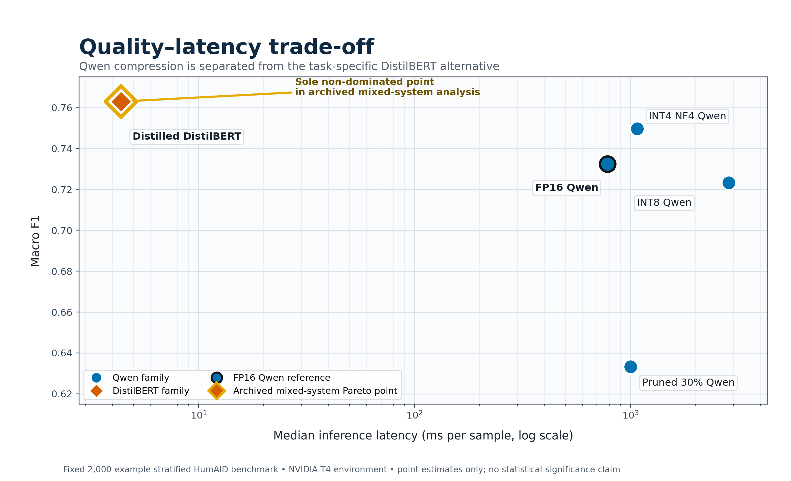

# Green AI Compression for Disaster-Tweet Classification

An empirical study of quality-efficiency trade-offs for 10-class HumAID disaster-tweet classification. A QLoRA-fine-tuned Qwen2.5-3B-Instruct teacher is evaluated in FP16, INT8, INT4 NF4, and at 30%, 50%, and 70% unstructured magnitude pruning. A hard-label DistilBERT control and a knowledge-distilled DistilBERT student are evaluated separately as task-specific deployment alternatives. The study reports predictive quality alongside latency, throughput, peak allocated GPU memory, checkpoint size, and CodeCarbon-estimated energy/emissions.



> Fixed 2,000-example stratified benchmark on an NVIDIA T4 environment. Latency is median milliseconds per sample on a logarithmic axis. CodeCarbon values are estimates, not direct power measurements. No statistical-significance claim is made from this figure.

## Research question

How do quantization, unstructured magnitude pruning, and task-specific knowledge distillation change predictive quality and measured deployment efficiency for a QLoRA-fine-tuned 3B language model on disaster-tweet classification?

## Key findings

- **Architecture-preserving Qwen compression:** INT4 NF4 is the strongest tested quality-memory option. It reaches 0.7565 accuracy and 0.7497 macro F1 while reducing recorded peak allocated GPU memory by 65.77% relative to FP16. Its latency and estimated energy are higher than FP16 in this T4 setup, so it is not a universal winner.
- **Pruning:** 30% one-shot unstructured pruning remains operational but falls to 0.6395 accuracy and 0.6333 macro F1. At 50%, accuracy is 0.0005 and 99.6% of outputs are unmatched; at 70%, accuracy is 0 and all outputs are unmatched.
- **Task-specific deployment alternative:** The distilled DistilBERT reaches 0.7735 accuracy and 0.7630 macro F1. It is a separate discriminative classifier, not a compressed Qwen checkpoint.
- **Pareto result:** The distilled student is the sole non-dominated fully measured task-specific point in the archived mixed-system analysis. Within Qwen, FP16 and INT4 NF4 retain different trade-off advantages.
- **Rare classes:** Results do not support a blanket claim that compression systematically harms rare classes. The missing/found category has only 9 examples in the fixed benchmark, so its F1 is highly uncertain.

## Comparison scopes

| Scope | Models |
|---|---|
| Architecture-preserving compression | FP16 Qwen, INT8 Qwen, INT4 NF4 Qwen, and pruned Qwen variants |
| Task-specific deployment alternative | Hard-label DistilBERT and distilled DistilBERT |

The DistilBERT systems change both architecture and inference procedure from autoregressive label generation to direct classification. Cross-family latency comparisons therefore describe end-to-end deployment behavior, not isolated kernel-level compression.

## Methods

1. Clean and stratify the HumAID corpus into train, validation, and test splits.
2. Fine-tune Qwen2.5-3B-Instruct with QLoRA, then merge the adapter before post-training compression.
3. Evaluate FP16, INT8, INT4 NF4, and 30/50/70% layer-wise unstructured magnitude-pruned variants.
4. Train a DistilBERT hard-label control and a student using hard labels plus Qwen-derived soft targets.
5. Compare quality, latency, throughput, recorded peak allocated GPU memory, storage, and CodeCarbon-estimated energy/emissions.

## Dataset and preprocessing

- Dataset: HumAID disaster-related tweets
- Classes: 10 humanitarian-information categories
- Cleaned corpus: 53,530 tweets
- Training split: 37,471 examples
- Held-out test split: 8,030 examples
- Direct compression benchmark: fixed stratified 2,000-example subset, `random_state=42`
- Rare benchmark support: 9 missing/found examples

See [methodology](docs/methodology.md) for the evidence-backed protocol summary.

## Evaluation metrics

Predictive metrics include accuracy, macro F1, weighted F1, and unmatched-generation rate. Efficiency metrics include single-example median latency, formal throughput, peak allocated GPU memory, checkpoint size where measured, and CodeCarbon-estimated energy/emissions on a fixed 100-example workload. Missing measurements remain missing.

## Main results

| Variant | Scope | Accuracy | Macro F1 | Median latency | Peak GPU memory | Energy / 100 examples |
|---|---|---:|---:|---:|---:|---:|
| FP16 Qwen | Qwen reference | 0.7410 | 0.7325 | 782.00 ms | 5.769 GB | 0.002608865 kWh (est.) |
| INT8 Qwen | Qwen quantization | 0.7310 | 0.7232 | 2,849.00 ms | 3.245 GB | 0.007451009 kWh (est.) |
| INT4 NF4 Qwen | Qwen quantization | 0.7565 | 0.7497 | 1,074.00 ms | 1.975 GB | 0.003438705 kWh (est.) |
| Pruned 30% Qwen | Qwen pruning | 0.6395 | 0.6333 | 1,001.76 ms | 2.8954 GB* | 0.002974727 kWh (est.) |
| Pruned 50% Qwen | Qwen pruning; unusable | 0.0005 | 0.0014 | 753.60 ms | 5.7688 GB | 0.002516000 kWh (est.) |
| Pruned 70% Qwen | Qwen pruning; unusable | 0.0000 | 0.0000 | 782.44 ms | 5.8273 GB | 0.002446858 kWh (est.) |
| Hard-label DistilBERT | Task-specific control | 0.7640 | 0.7467 | Not reported | Not reported | Not reported |
| Distilled DistilBERT | Task-specific alternative | 0.7735 | 0.7630 | 4.38 ms | 0.2681 GB | 1.413e-5 kWh (est.) |

\*The pruned-30% memory value is the busiest-GPU peak in a two-GPU run and is not directly equivalent to total memory use. The pruned-50/70 latency and energy values are not useful efficiency successes because predictive behavior collapsed.

The distilled checkpoint contains 66,961,162 parameters and is approximately 256.13 MB under the source unit convention, versus 3,085,938,688 parameters for the teacher. Its formal throughput is approximately 227.36 samples/s.

## Pareto and rare-class findings

The archived mixed-system Pareto comparison considers five usable variants with complete quality, median latency, memory, and estimated-energy records. Under those objectives, the distilled DistilBERT is the sole non-dominated point. Restricting the candidate set to architecture-preserving Qwen variants changes the result: FP16 and INT4 NF4 are both non-dominated in quality-latency space, and INT4 NF4 is the strongest tested quality-memory option.

For missing/found F1, the recorded values are 0.88 for FP16, INT8, and INT4; 0.94 for pruned 30%; and 0.84 for the distilled student. For urgent-needs F1, they are 0.51, 0.49, 0.52, 0.50, and 0.55, respectively. These mixed outcomes, combined with only 9 missing/found examples, do not support a general rare-class degradation claim.

## Reproducibility

This repository preserves the final report, evidence audit, extracted figures, an evidence-reconstructed metric record, cleaned Phase 2-4 notebooks/source modules, and the original Kaggle execution notebooks for Phases 8-12. Those later notebooks cover merged-Qwen evaluation and FP16/INT8/INT4 benchmarking, pruning, knowledge distillation, unified comparison/Pareto analysis, and final visualization. Large datasets, Qwen weights, adapters, checkpoints, and phase backup archives are intentionally excluded.

To reproduce or audit the available workflow:

1. Create the environment from `requirements.txt` for the included Phase 2-4 code.
2. Obtain HumAID through its permitted source and recreate the documented splits.
3. Run preprocessing, QLoRA fine-tuning, merge-before-quantize, evaluation, pruning, and distillation in order.
4. Reuse the fixed 2,000-example benchmark and documented T4 measurement protocol.
5. Compare generated metrics against the report ledger and evidence audit.

See [reproducibility](docs/reproducibility.md) for current and pending requirements.

## Repository structure

```text
.
├── README.md
├── CITATION.cff
├── .gitignore
├── docs/
├── models/
├── data/
├── notebooks/
├── src/
├── requirements.txt
├── outreach/
├── report/
└── results/
    └── plots/
```

The included notebooks cover dataset exploration, preprocessing, the classical baseline:

- `08_phase8_quantization_benchmark.ipynb` — merged-Qwen evaluation plus FP16, INT8, and INT4 NF4 benchmarking
- `09_phase9_pruning.ipynb` — 30%, 50%, and 70% unstructured magnitude pruning
- `10_phase10_knowledge_distillation.ipynb` — teacher targets, distilled DistilBERT, and hard-label control
- `11_phase11_final_comparison.ipynb` — unified comparison, relative deltas, Pareto analysis, and rare-class comparison
- `12_phase12_visualizations.ipynb` — final research figures


## Research paper

- [Final Phase 13 research paper](report/final_research_paper.pdf)
- [Research report in Markdown](report/research_report.md)
- [Evidence audit](report/evidence_audit.md)

This is a research project report. It is not described as peer-reviewed or formally published.

## Limitations

The experiments cover one dataset, one primary teacher model, one fixed benchmark subset for cross-method comparison, and a T4 execution environment. Student runs are not seed-averaged. CodeCarbon energy and emissions are modeled estimates rather than direct power measurements. Cross-architecture comparisons combine changes in architecture, scale, and inference procedure. See [limitations](docs/limitations.md).

## Citation

Citation metadata is provided in [CITATION.cff](CITATION.cff).

## Authors and contact

### Mayuresh Sharma

- **Author:** Mayuresh Sharma
- **University:** Guru Gobind Singh Indraprastha University (GGSIPU), New Delhi
- **Degree / year:** B.Tech in Computer Science and Engineering, 3rd year
- **Research interests:** Efficient AI and large language models, Green AI, hardware-aware machine learning, AI for fintech, and Web3/blockchain systems
- **GitHub:** https://github.com/Lucky10406
- **LinkedIn:** https://www.linkedin.com/in/mayuresh-sharma-a08526315
- **Email:** mayureshsharma10406@gmail.com

### Aditya Chauhan

- **Co-author:** Aditya Chauhan
- **University:** Guru Gobind Singh Indraprastha University (GGSIPU), New Delhi
- **Degree / year:** B.Tech in Computer Science and Engineering, 3rd year
- **Email:** aditya29ch@gmail.com
