# Green AI Compression for Disaster-Tweet Classification: An Empirical Comparison of Quantization, Pruning, and Knowledge Distillation

**Mayuresh Sharma and Aditya Chauhan**  
Guru Gobind Singh Indraprastha University (GGSIPU), New Delhi  
B.Tech in Computer Science and Engineering, 3rd year  
Emails: Mayuresh Sharma — mayureshsharma10406@gmail.com; Aditya Chauhan — aditya29ch@gmail.com

Research report • Phase 13 synthesis of experiments through Phase 12

Abstract — Large language models impose inference costs that require joint evaluation of predictive quality and efficiency. We study ten-class HumAID disaster-tweet classification using a QLoRA-fine-tuned Qwen2.5-3B-Instruct model, comparing inference quantization, unstructured magnitude pruning, and task-specific knowledge distillation. The cleaned corpus contains 53,530 tweets; full-test accuracy is 73.84% on 8,030 examples. On a fixed 2,000-example benchmark, FP16 accuracy is 74.10%, INT8 73.10%, and INT4 NF4 75.65%. INT4 reduces recorded peak GPU memory by 65.77%, but increases estimated inference energy by 31.81% relative to FP16. Pruning at 30% sparsity reduces accuracy to 63.95%; 50% and 70% sparsity collapse predictive behavior. A 66.96-million-parameter distilled DistilBERT classifier reaches 77.35% accuracy and 0.7630 macro F1, compared with 76.40% and 0.7467 for its hard-label control. The distilled student is the sole non-dominated variant among five usable systems with complete quality, latency, memory, and energy records, with 99.44% lower median latency and 99.46% lower estimated energy than FP16. This comparison permits an architecture change; within Qwen, FP16 and INT4 retain distinct latency–energy and quality–memory advantages. Rare-class outcomes are mixed, and missing/found support is only nine. Thus, tested four-bit inference preserves quality, whereas naive pruning degrades it before functional collapse. Conclusions remain conditional on one dataset, the T4 execution environment, and estimated operational energy.

Keywords: Green AI; large language models; quantization; pruning; knowledge distillation; disaster-tweet classification; efficient inference; Pareto analysis

## 1. Introduction

The rapid increase in model scale has made computational efficiency a first-class research concern rather than a deployment afterthought. The Green AI framing argues that accuracy should be reported alongside computational cost and related efficiency measures [1]. This is particularly relevant for large language models (LLMs), where parameter count, memory footprint, and autoregressive generation can make otherwise capable systems difficult to deploy on constrained hardware.

Humanitarian social-media classification is a useful test case for this question. During disasters, social media streams contain reports of casualties, infrastructure damage, urgent needs, donations, evacuations, advice, and large volumes of less actionable information. HumAID was introduced to support machine-learning research on this noisy, time-critical domain [2]. The present study asks whether a compact 3B-parameter instruction-tuned model can be adapted for this task and then compressed without materially degrading predictive performance.

We use Qwen2.5-3B-Instruct [3] as the base model and QLoRA [5] for parameter-efficient adaptation. The LoRA mechanism freezes pretrained weights and represents task-specific updates with low-rank matrices [4], while QLoRA enables training through a frozen 4-bit quantized base model and introduces NF4 and Double Quantization for memory-efficient fine-tuning [5]. After training, the LoRA adapter is merged into the base model before applying post-training runtime quantization, ensuring that the benchmark measures the fine-tuned model rather than the untouched base model.

The main contribution of the current manuscript is an empirical quality-efficiency comparison of three compression families evaluated around the same QLoRA-fine-tuned teacher and fixed benchmark: low-bit quantization (INT8 and INT4 NF4), one-shot layer-wise unstructured magnitude pruning (30%, 50%, and 70% sparsity), and knowledge distillation into a 66.96M-parameter DistilBERT classifier. In addition to accuracy and F1, the study reports latency, throughput, GPU memory, checkpoint size where directly measured, estimated operational energy, and estimated carbon emissions. The expanded results show that nominal compression does not guarantee usable efficiency: quantization largely preserves quality, pruning exhibits a severe accuracy cliff, and task-specific distillation yields the strongest measured deployment point while changing the architecture from autoregressive generation to direct classification. Completed Phase 11 synthesis and Phase 12 visualization extend this comparison with explicit Pareto scope, rare-category outcomes, and an auditable record of the measured and derived values.

The current contributions are: (i) a documented HumAID preprocessing and stratified-splitting pipeline; (ii) a QLoRA configuration that trains only 7,372,800 adapter parameters (approximately 0.238% of the 3.09B-parameter model); (iii) a full held-out evaluation of the fine-tuned model on 8,030 examples; (iv) matched FP16/INT8/INT4 benchmarking on a fixed 2,000-example stratified subset; (v) a three-level unstructured magnitude-pruning sweep identifying a functional cliff between 30% and 50% sparsity; (vi) a knowledge-distillation experiment that trains a 66.96M-parameter DistilBERT student from hard labels plus teacher-derived soft targets; (vii) a hard-label-only DistilBERT ablation that isolates the incremental benefit of the soft-target objective in this run; and (viii) a joint quality, latency, memory, storage, energy, and carbon analysis across the tested variants. The completed synthesis adds (ix) a consolidated eight-variant metric record, FP16-relative deltas, and the archived five-variant Pareto flags; (x) a scoped Pareto verification distinguishing Qwen-preserving choices from task-specific systems; (xi) a two-category F1 comparison with explicit rare-class support limits; and (xii) three Phase 12 figures showing performance-latency, normalized energy, and storage-memory trade-offs. These are analyses of recorded experiments, not additional training or benchmark runs.

## 2. Research Questions

RQ1. Can QLoRA adapt a 3B instruction model to ten-class humanitarian tweet classification with competitive macro-level performance?

RQ2. How do INT8 and INT4 NF4 inference affect accuracy and macro F1 relative to the merged FP16 model?

RQ3. Do reductions in numerical precision translate into better latency, throughput, GPU memory, checkpoint size, energy, and estimated carbon emissions on the available Tesla T4 platform?

RQ4. Where does predictive degradation begin in the tested one-shot unstructured pruning sweep, when does functionality collapse, and do nominal sparsity increases yield practical storage or runtime benefits?

RQ5. Can knowledge distillation transfer task behavior to a smaller classifier, and do teacher soft targets improve over the matched hard-label student?

RQ6. Which usable variants are Pareto-optimal, and how do conclusions differ between architecture-preserving Qwen compression and task-specific deployment alternatives?

RQ7. Do rare-class results show disproportionate degradation under compression, and what can be concluded given the available class support?

## 3. Related Work

### 3.1 Green AI and efficiency-aware evaluation

Schwartz et al. argue that computational efficiency should be treated as an evaluation criterion alongside accuracy and that the computational price of training and running models should be reported [1]. This study follows that principle by treating memory, latency, throughput, energy, and carbon estimates as co-equal experimental outcomes rather than secondary implementation details.

### 3.2 LoRA and QLoRA

LoRA represents a dense weight update as a product of two low-rank trainable matrices while freezing the pretrained weight matrix [4]. Because the low-rank update can be merged into the frozen weight for deployment, LoRA can avoid additional inference layers. QLoRA extends this parameter-efficient idea to a frozen 4-bit base model. Dettmers et al. introduce 4-bit NormalFloat (NF4), Double Quantization of quantization constants, and Paged Optimizers, and report that NF4 QLoRA can match 16-bit fine-tuning or LoRA performance across several benchmarks [5].

### 3.3 Low-bit inference

For 8-bit inference, LLM.int8() demonstrated that transformer memory can be reduced substantially while handling outlier features through mixed-precision decomposition [6]. However, memory reduction alone does not guarantee lower wall-clock latency: practical speed depends on kernels, hardware support, dequantization overhead, memory bandwidth, and device placement. This distinction motivates direct measurement on the actual deployment hardware rather than inferring speed from bit width.

### 3.4 Magnitude pruning

Magnitude-based pruning removes parameters judged least important according to weight magnitude. In unstructured pruning, individual scalar weights are zeroed without changing the dense tensor shapes. This makes the method easy to apply but does not, by itself, shrink ordinary dense checkpoints or guarantee acceleration on general-purpose GPU kernels; realizing storage or speed benefits typically requires sparse representations and hardware/software support. The present study therefore treats sparsity as an empirical intervention and measures both predictive degradation and practical efficiency rather than assuming that a higher zero fraction is automatically beneficial.

### 3.5 Knowledge distillation

Knowledge distillation transfers information from a larger teacher to a smaller student using softened output targets, commonly controlled by a temperature parameter [8]. Hinton et al. show that a student can learn from both hard targets and the teacher's relative preference structure across classes. In the present study the teacher is generative rather than a native classifier, so a ten-class soft target is constructed by scoring the complete candidate label sequences under the teacher, length-normalizing their conditional log-probabilities, and applying temperature-scaled softmax. The resulting distributions are used with a KL-divergence term alongside standard cross-entropy supervision.

## 4. Dataset and Preprocessing

The project uses the HumAID-all training split distributed through the QCRI/HumAID-all dataset interface. The loaded split contains 53,531 tweets and two fields: tweet_text and class_label. HumAID itself was constructed from disaster-related Twitter data and provides humanitarian information categories for supervised classification [2]. In the representation used here, no event identifier was available, so event-level stratification could not be performed.

Cleaning normalizes invalid UTF-8 sequences and removes a leading retweet marker of the form “RT @username:” while retaining hashtags, mentions within the tweet body, and emojis. Deduplication is performed after cleaning and removes one exact duplicate, leaving 53,530 unique examples. A fixed random seed of 42 is then used for a stratified 70/15/15 split: 37,471 training examples, 8,029 validation examples, and 8,030 held-out test examples. The class proportions remain stable across splits.

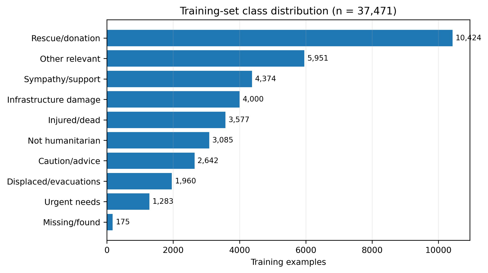

Figure 1. Class distribution of the 37,471-example training split. The dataset is substantially imbalanced; the rarest class, missing/found people, has only 175 training examples.

The imbalance motivates reporting macro F1 in addition to accuracy and weighted F1. Macro F1 gives each class equal importance and is therefore sensitive to failures on rare categories that can be hidden by aggregate accuracy.

The training class counts shown in Figure 1 are: rescue_volunteering_or_donation_effort 10,424; other_relevant_information 5,951; sympathy_and_support 4,374; infrastructure_and_utilities_damage 4,000; injured_or_dead_people 3,577; not_humanitarian 3,085; caution_and_advice 2,642; displaced_people_and_evacuations 1,960; requests_or_urgent_needs 1,283; and missing_or_found_people 175. These counts sum to 37,471; they describe the training split, not the full corpus. The nine-example missing/found support in the benchmark makes individual errors consequential.

The recorded Qwen prompt enumerates the ten exact labels and asks for a single classification of the supplied tweet; exact prompt wording, chat-template revision, Qwen tokenizer revision, padding policy, and training sequence limit are not supplied. The student uses the distilbert-base-uncased tokenizer and a recorded maximum sequence length of 128; finer tokenization settings are unreported. Exact deduplication before splitting and reuse of a held-out subset reduce direct split contamination. They do not establish event-disjoint evaluation, near-duplicate removal, or exclusion from pretraining data. These protections cannot be claimed without additional evidence.

## 5. Baseline and Fine-Tuning Methodology

### 5.1 Classical baseline

The classical baseline uses a TF-IDF representation with 5,000 features and unigram/bigram features, followed by class-weighted logistic regression (max_iter = 1000). The originally recorded validation result is 0.7032 macro F1 and 0.7314 weighted F1. For manuscript-level comparability, the same documented configuration was re-executed on the saved held-out test split without hyperparameter changes, yielding 71.30% accuracy, 0.6965 macro F1, and 0.7168 weighted F1. This post-hoc test evaluation is reported separately from the original Phase 4 record to preserve provenance.

### 5.2 QLoRA fine-tuning

Qwen2.5-3B-Instruct is fine-tuned with QLoRA. The adapter uses rank r = 16, LoRA alpha = 32, dropout = 0.05, and targets the q_proj, k_proj, v_proj, and o_proj attention projections. The final adapter artifact contains 288 tensors and 7,372,800 trainable parameters. Training uses three epochs, per-device batch size 4, gradient accumulation 4, learning rate 2e-4, and FP16 training in the recorded run. The supervised prompt asks the model to classify each disaster-related tweet into one of the ten exact category labels.

Figure 2 shows the training and evaluation pipeline. QLoRA training keeps the four-bit base weights frozen and updates the LoRA adapters [4, 5]. The recorded FP16 setting describes training arithmetic; it does not mean all base weights were trained in FP16. After adaptation, the adapter is merged into the base model to form the inference reference before the independent INT8 or INT4 runtime intervention. The adapter identifier or repository revision beyond the saved artifact description is unreported.

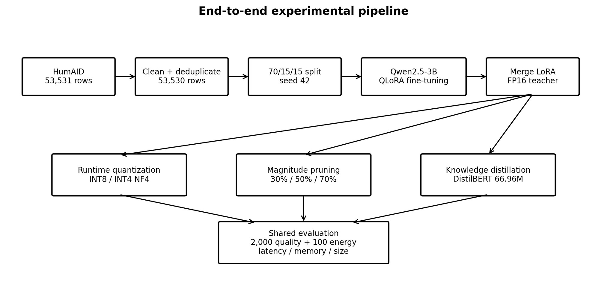

Figure 2. End-to-end experimental pipeline through knowledge distillation. Quantization and pruning operate on the merged FP16 teacher, whereas distillation trains a separate 66.96M-parameter DistilBERT classifier from teacher-derived soft targets and ground-truth labels; all variants feed a shared evaluation framework where the architecture permits a fair comparison. The original Phase 1-10 pipeline is preserved; Sections 5.5 and 7.9-7.11 describe the completed synthesis and visualization stages.

### 5.3 Unstructured magnitude pruning

Pruning is applied to fresh copies of the merged, unquantized FP16 fine-tuned model so that pruning and quantization remain independent compression interventions. For every torch.nn.Linear layer, weights are ranked by absolute magnitude and the smallest 30%, 50%, or 70% are set directly to zero. Direct in-place zeroing is used because the standard torch.nn.utils.prune mask-based implementation exceeded Tesla T4 memory during pruning; the resulting operation is still layer-wise unstructured magnitude pruning, but without retaining temporary pruning masks. Each sparsity level starts from the same original merged checkpoint rather than from a previously pruned model. The achieved zero fraction is verified after pruning. The 30%-sparse model was serialized in standard dense safetensors format and remained 5.763 GB, equal to the original dense checkpoint; higher-sparsity checkpoints were not retained as separate artifacts after storage constraints were encountered.

### 5.4 Knowledge distillation

The distillation teacher is the merged Qwen2.5-3B-Instruct model containing 3,085,938,688 parameters. The student is distilbert-base-uncased with a newly initialized ten-class sequence-classification head and 66,961,162 trainable parameters. The student therefore contains approximately 46.08 times fewer parameters than the teacher. Rather than using the teacher's next-token probability for only the first token of a category name, the experiment scores each complete candidate label sequence conditioned on the fixed classification prompt. Token log-probabilities are averaged within each label to reduce systematic length bias, and the ten length-normalized scores are converted into a probability distribution with temperature T = 4.0. This produces a task-level soft target even though the teacher itself has no native classification head.

The student is trained on all 37,471 training examples for three epochs with batch size 16, learning rate 2e-5, maximum sequence length 128, and gradient clipping at 1.0. The objective blends KL divergence to the teacher distribution with cross-entropy to the ground-truth class: alpha = 0.5 for the soft-target term and 1-alpha for the hard-label term, with the conventional T^2 scaling applied to the KL component [8]. Teacher soft targets are generated once, saved as a 37,471 x 10 matrix, and validated to contain no NaNs with per-row probability sums equal to one within floating-point tolerance. A second DistilBERT model is trained with the same architecture and core hyperparameters using hard labels only, providing an ablation for the incremental value of teacher supervision.

With teacher targets generated offline, teacher parameters are fixed during student optimization. The recorded objective is L = αT² KL(p_teacher,T ∥ p_student,T) + (1 − α) CE(y, p_student), with T = 4 and α = 0.5. The temperature-softened teacher distribution is formed from full-label sequence scores, rather than a native teacher classifier head. The saved description supports this objective, but the supplied backups do not expose loss-reduction conventions, exact tokenizer handling, or implementation code for an independent training rerun. The hard-label ablation tests the incremental soft-target contribution in one matched run, not an architecture-controlled comparison with Qwen.

### 5.5 Cross-method synthesis and visualization methodology

Phase 11 consolidates the saved results in master_comparison.csv, derives FP16-relative changes in usable_model_deltas.csv, records usability-filtered Pareto flags in pareto_analysis.csv, and compares two class-level F1 measures in rare_class_comparison.csv. Phase 12 carries these values into phase12_plot_data.csv and three paired PNG/PDF figures. No new model training, resampling, or inference measurements are reported by these backups.

A variant A dominates B for an explicitly stated objective set if A is no worse on every objective and strictly better on at least one. For the verification reported here, macro F1 is maximized and median latency, peak allocated GPU memory, and estimated energy for 100 examples are minimized. This definition is applied only to usable variants with complete values for those four objectives. The backup contains dominance flags but not the original implementation or an explicit objective specification; the stated verification reproduces its flags without claiming to recover the missing code. Accuracy-latency and macro-F1-latency projections are examined separately. Storage is reported separately because quantized checkpoint sizes are missing.

The archived usable flag excludes Pruned_50 and Pruned_70, whose predictions collapse, but retains Pruned_30 despite its quality loss and 0.3% unmatched rate. HardLabel_DistilBERT remains in the quality ablation and full metric record; its median latency, memory, energy, carbon, and checkpoint size are absent, so it is excluded from complete-case Pareto verification. Its measured throughput is retained without converting it into an invented median latency.

FP16-relative accuracy changes use 100 × (accuracy_variant − accuracy_FP16), in percentage points; macro-F1 changes use direct subtraction. Memory and energy reductions use 100 × (1 − value_variant/value_FP16), so negative reductions denote increases. Phase 12 transforms median seconds to milliseconds by ×1,000 and energy in kWh for 100 examples to Wh per 1,000 by ×10,000. The energy transformation is a workload normalization, not a separately measured 1,000-example run. The supplied size and memory fields use GB ×1,024 and are labeled MB in the original plots. These labels and values are retained as the source convention; the conversion is binary-style and should not be read as a verified decimal-byte measurement. No missing quantity is imputed.

Rare-class synthesis uses the two-decimal F1 values supplied for missing_or_found_people and requests_or_urgent_needs. Missing/found support is nine in the 2,000-example benchmark, as recorded in both summaries; urgent-needs support and the class-level confusion counts are not provided in these backups. The analysis therefore reports descriptive F1 differences without inventing precision, recall, confidence intervals, or significance tests.

### 5.6. Inference quantization and numerical scope

The architecture-preserving precision comparison uses the merged FP16 Qwen reference, bitsandbytes INT8, and bitsandbytes four-bit NF4 with Double Quantization [5, 6]. These are runtime-loaded representations; separate quantized checkpoint files were not measured. Training-time QLoRA quantization and post-training inference quantization are distinct interventions. Exact bitsandbytes version, INT8 outlier threshold, four-bit compute dtype, quantization exclusions, and serialization configuration are unreported in the supplied evidence and cannot be reconstructed from observed memory. No two-bit inference or intermediate pruning levels were tested in the reported sweep.

## 6. Experimental Setup and Evaluation Metrics

### 6.1. Benchmark and measurement protocol

Phase 6 evaluates the fine-tuned model on all 8,030 held-out test examples using deterministic generation (do_sample = False). The benchmark prompt enumerates the ten valid category labels and decoding is restricted to the newly generated tokens. Outputs are mapped to exact labels, with unmatched generations tracked explicitly.

Phase 8, the pruning experiments, and the Phase 10 student evaluations use the same fixed stratified subset of 2,000 test examples for direct quality comparison. This choice reduces autoregressive teacher evaluation time while preserving test-set class proportions. The subset is generated once with random_state=42 and reused without resampling. Quantized and pruned Qwen variants receive the same prompts, decoding settings, exact-label parser, and metric definitions; the DistilBERT students operate as native classifiers on the same tweet texts and therefore have no unmatched-generation failure mode.

Two quantized variants are evaluated: bitsandbytes INT8 and bitsandbytes INT4 using NF4 with Double Quantization. Phase 7 sanity checks verify that both variants load successfully and produce valid labels before full benchmarking. The merged FP16 checkpoint occupies approximately 5.76 GB on disk; INT8 and INT4 were instantiated as runtime quantized models and were not serialized as independent checkpoints, so separate disk sizes are not reported.

Student latency uses the same 5-warm-up, 50-timed-trial CUDA-synchronized protocol on a fixed tweet. Student GPU memory is re-measured after clearing training objects and reloading only the distilled checkpoint, and the reported peak allocated value on GPU 0 is 0.2681 GB. The fixed 100-example energy sample is reused for CodeCarbon estimation. Because the student performs one discriminative forward pass while the teacher performs autoregressive text generation, cross-architecture runtime comparisons represent end-to-end deployment behavior rather than isolated kernel-level compression effects.

The recorded hardware is a Kaggle environment with two available NVIDIA Tesla T4 GPUs. Most inference measurements use GPU 0; the 30%-pruned model spans both GPUs, so its reported 2.8954 GB is the busiest individual GPU peak, not total accelerator memory. Single-example timing uses batch size 1, five warm-ups, 50 timed trials, and CUDA synchronization; Qwen generation permits at most 15 new tokens. Full-benchmark throughput, formal single-example throughput, and the 100-example energy run are distinct workloads. Table 1 records the known protocol. Python, PyTorch, CUDA, Transformers, PEFT, bitsandbytes, and CodeCarbon version numbers, host CPU/RAM, driver revision, and a complete environment lockfile are not supplied.

CodeCarbon estimates operational energy and CO2e for a fixed 100-example workload [7]. The measurements are software-based estimates of resource consumption and grid-related emissions, rather than readings from a calibrated external power meter. Exact tracking mode, sampling interval, region/carbon-intensity input, component coverage, and version are unreported. Training, teacher-target generation, embodied emissions, and a deployment lifetime amortization are outside the reported inference boundary. The normalized Phase 12 energy values apply the explicit arithmetic in Section 5.5 and do not establish performance on a newly executed 1,000-example workload.

Table 1. Experimental configuration and benchmark controls.

| Component | Setting |
| --- | --- |
| Base model | Qwen2.5-3B-Instruct |
| Task | 10-class HumAID tweet classification |
| LoRA | r=16, alpha=32, dropout=0.05 |
| Target modules | q_proj, k_proj, v_proj, o_proj |
| Fine-tuning | 3 epochs; batch 4; grad accumulation 4; LR 2e-4 |
| Direct quality benchmark | 2,000 stratified test examples; random_state=42 |
| Generation | Deterministic; exact-label prompt; max_new_tokens <= 15 |
| Latency | 5 warm-up + 50 timed trials; CUDA synchronized |
| Energy | 100 fixed examples; CodeCarbon estimate |
| Hardware | 2 x NVIDIA Tesla T4 available; model execution primarily on GPU 0 |
| Pruning | Layer-wise unstructured magnitude pruning at 30%, 50%, 70%; fresh FP16 source per level |
| Distillation student | DistilBERT-base-uncased; 66,961,162 parameters; 10-class head |
| Distillation training | 3 epochs; batch 16; LR 2e-5; max length 128; T=4.0; alpha=0.5 |
| Teacher soft targets | Full-label conditional sequence scoring; length- normalized; 37,471 x 10 saved matrix |
| Student ablation | Matched DistilBERT trained with hard-label cross-entropy only |

### 6.2. Metric definitions and inference limits

Accuracy is the fraction of all benchmark examples classified correctly. For class c, precision = TPc/(TPc + FPc), recall = TPc/(TPc + FNc), and F1 = 2 × precision × recall/(precision + recall). Macro F1 averages class F1 equally across the ten classes and is central under imbalance; weighted F1 weights class F1 by support. The exact zero-division implementation is unreported. Unmatched rate is the fraction of generative outputs that fail exact-label parsing; collapsed variants remain in the result record. No unavailable per-class precision, recall, or confusion count is inferred from rounded F1.

Latency is elapsed inference time per example, reported using the source statistic (median unless explicitly labeled mean). Throughput is examples divided by elapsed seconds for the stated workload; the reciprocal of a median is not generally a measured mean-throughput estimate. Peak GPU memory is recorded peak allocated device memory, subject to the placement caveat above. Checkpoint size is saved model storage, not peak runtime memory or an assumed bit-width ratio. Energy is the CodeCarbon estimate in kWh per 100 examples; CO2e is the associated estimated emissions in grams. Percentage-point accuracy changes and relative resource reductions are defined in Section 5.5. Display rounding in main tables is complemented by source-precision records in Tables 13–20.

The baseline manuscript reports exact paired McNemar tests for INT8 and INT4 versus FP16; their discordant counts and p-values are retained in Section 7.2. These tests address paired accuracy differences for this sample, not a preregistered practical-loss tolerance or robustness across seeds. No new significance tests or confidence intervals are introduced. Because neither a practical degradation threshold nor repeated-seed uncertainty was specified, the study can identify observed quality losses and bracket collapse only at tested sparsity levels.

## 7. Results

### 7.1 Full held-out fine-tuned model evaluation

Figure 3 presents the full-test evaluation. On the complete 8,030-example held-out test set, the QLoRA fine-tuned model makes 5,929 correct predictions and achieves 73.84% accuracy, 0.7205 macro F1, and 0.7288 weighted F1. Only four outputs are unmatched (0.050%). Relative to the post-hoc TF-IDF logistic-regression test evaluation, the fine-tuned LLM improves accuracy by 2.54 percentage points and macro F1 by 0.0240.

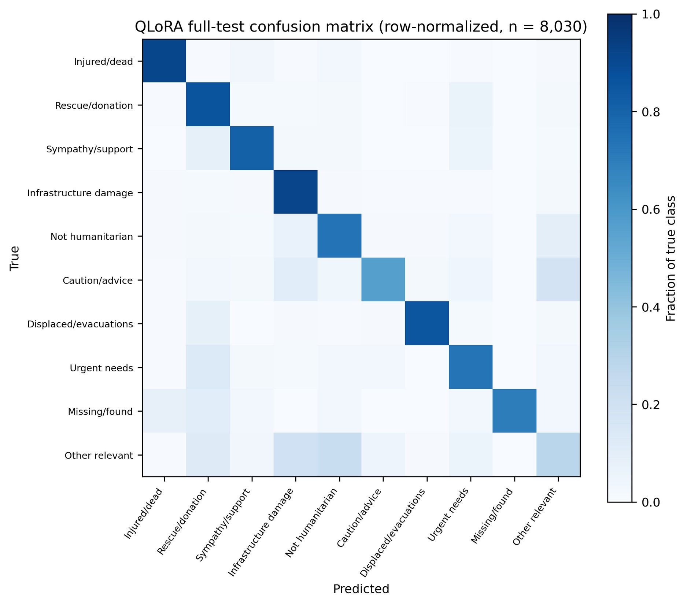

Figure 3. Row-normalized confusion matrix for the QLoRA fine-tuned model on the full 8,030-example test set. The most persistent difficulty is the broad “other relevant information” category, which overlaps semantically with several actionable categories.

### 7.2 Direct FP16, INT8, and INT4 comparison

Table 2. Predictive quality on the fixed 2,000-example stratified benchmark.

| Model | Accuracy | Macro P | Macro R | Macro F1 | Weighted F1 |
| --- | --- | --- | --- | --- | --- |
| FP16 baseline | 0.7410 | 0.7504 | 0.7493 | 0.7325 | 0.7311 |
| INT8 | 0.7310 | 0.7481 | 0.7346 | 0.7232 | 0.7232 |
| INT4 NF4 | 0.7565 | 0.7604 | 0.7649 | 0.7497 | 0.7490 |

Table 2 and Figures 4–5 summarize the precision comparison. INT8 decreases accuracy by 1.00 percentage point and macro F1 by 0.0093 relative to FP16. INT4 NF4, by contrast, increases accuracy by 1.55 percentage points and macro F1 by 0.0172 on this fixed subset. A paired exact McNemar analysis computed from the saved predictions finds asymmetric correctness changes for both INT8 versus FP16 (39 FP16-only correct vs. 19 INT8-only correct; p = 0.0119) and INT4 versus FP16 (51 FP16-only correct vs. 82 INT4-only correct; p = 0.0090). These paired results indicate that the differences are unlikely to be explained solely by which examples happened to be sampled; however, they do not establish that quantization intrinsically improves generalization. The study uses one model, one subset, one hardware/software stack, and no repeated quantization seeds.

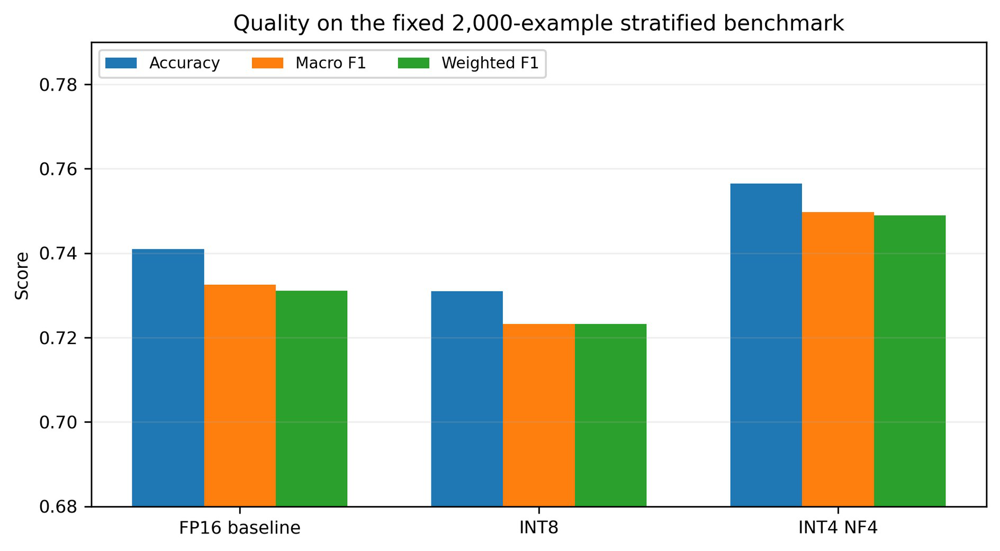

Figure 4. Accuracy, macro F1, and weighted F1 for FP16, INT8, and INT4 NF4 on the same 2,000 test examples.

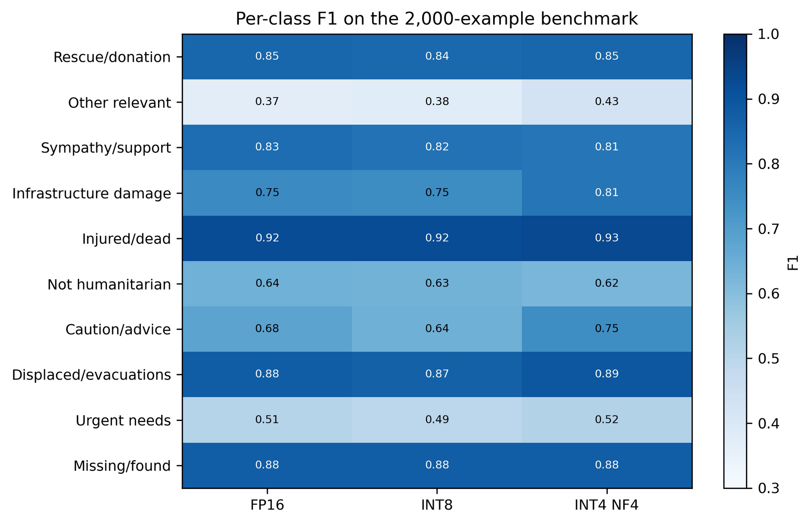

Figure 5. Per-class F1 across precision variants. INT4 gains are concentrated in several categories, including caution/advice, infrastructure damage, and other relevant information, while sympathy/support and not-humanitarian do not improve.

### 7.3 Latency, throughput, and GPU memory

Table 3. Runtime efficiency measurements.

| Model | Median latency (s) | Latency throughput (/s) | Peak GPU memory (GB) | 2k run throughput (/s) |
| --- | --- | --- | --- | --- |
| FP16 baseline | 0.782 | 1.271 | 5.769 | 0.976 |
| INT8 | 2.849 | 0.351 | 3.245 | 0.318 |
| INT4 NF4 | 1.074 | 0.929 | 1.975 | 0.760 |

Table 3 and Figures 6–7 show runtime and memory. The memory benefit of low-bit loading is substantial: INT8 reduces peak allocated GPU memory by 43.8% relative to FP16, and INT4 reduces it by 65.8%. The runtime result is less intuitive. FP16 is fastest at 0.782 s median latency. INT4 is 1.37x slower (1.074 s), while INT8 is 3.64x slower (2.849 s). The full 2,000-example run shows the same ordering: 0.976 samples/s for FP16, 0.760 for INT4, and 0.318 for INT8.

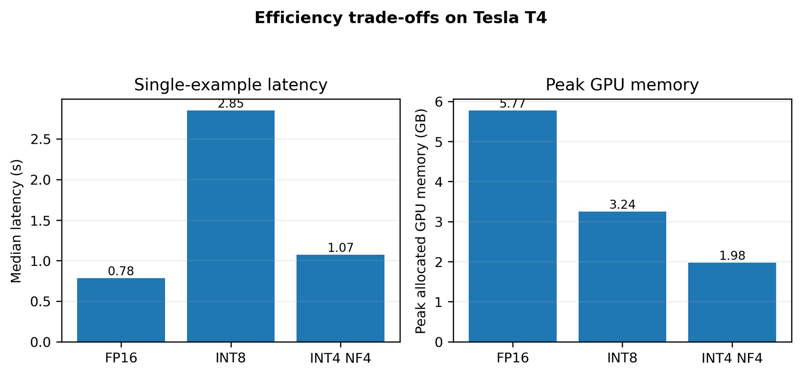

Figure 6. Lower precision substantially reduces peak allocated GPU memory, but the Tesla T4 runtime does not convert this memory reduction into lower latency.

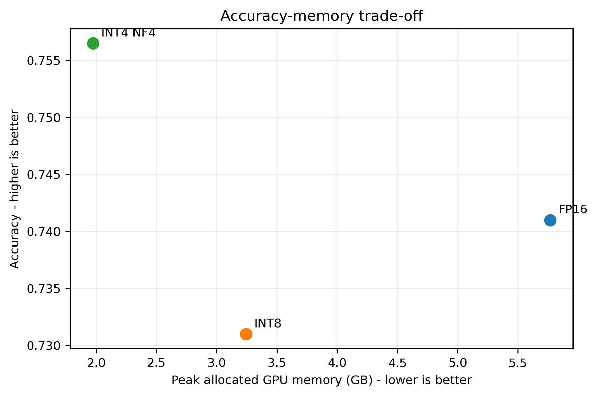

Figure 7. Accuracy-memory trade-off. Under these measurements INT4 NF4 provides the strongest memory/quality point, whereas FP16 remains preferable when latency and energy dominate.

### 7.4 Energy and carbon estimates

Table 4. CodeCarbon estimates for an identical 100-example inference workload.

| Model | 100-sample runtime (s) | Estimated energy (kWh) | Estimated emissions (g CO2e) |
| --- | --- | --- | --- |
| FP16 baseline | 84.40 | 0.002609 | 1.181 |
| INT8 | 298.37 | 0.007451 | 3.372 |
| INT4 NF4 | 111.31 | 0.003439 | 1.556 |

Table 4 and Figure 8 report the energy comparison. Among the three precision variants, FP16 is the lowest-energy variant in this environment at 0.002609 kWh for the fixed 100-example workload. INT4 uses 1.32x this estimate, while INT8 uses 2.86x. The carbon estimates follow the same ratios because the experiments share the same environment and carbon-intensity model. These are operational estimates rather than direct power-meter measurements and exclude embodied hardware emissions.

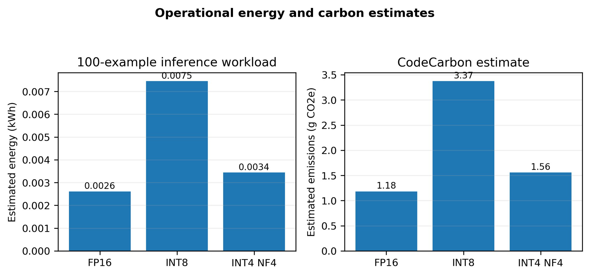

Figure 8. Estimated operational energy and carbon emissions for the same 100-example workload. INT8 is the least efficient variant under the tested T4/bitsandbytes configuration.

### 7.5 Magnitude-pruning sweep

Table 5 and Figures 9–10 retain all pruning outcomes. The pruning experiment reveals a sharp nonlinear failure boundary. At 30% sparsity, the model remains operational but accuracy falls from 74.10% to 63.95% and macro F1 from 0.7325 to 0.6333. At 50% sparsity, accuracy collapses to 0.05%, macro F1 to 0.0014, and 1,992 of 2,000 outputs (99.6%) fail the exact-label parser. At 70% sparsity, all 2,000 outputs are unmatched and every reported classification metric is zero. The usable-quality region therefore ends somewhere between 30% and 50% sparsity for this one-shot, no-recovery-fine-tuning setup.

Table 5. Predictive quality across the pruning sweep on the fixed 2,000-example benchmark.

| Variant | Sparsity | Accuracy | Macro P | Macro R | Macro F1 | Unmatched |
| --- | --- | --- | --- | --- | --- | --- |
| FP16 reference | 0% | 0.7410 | 0.7504 | 0.7493 | 0.7325 | - |
| Pruned 30% | 30% | 0.6395 | 0.7674 | 0.6483 | 0.6333 | 6 / 2000 |
| Pruned 50% | 50% | 0.0005 | 0.0500 | 0.0007 | 0.0014 | 1992 / 2000 |
| Pruned 70% | 70% | 0.0000 | 0.0000 | 0.0000 | 0.0000 | 2000 / 2000 |

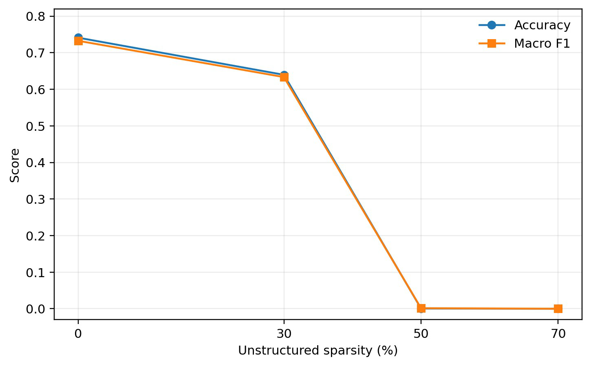

Figure 9. Accuracy and macro F1 versus unstructured sparsity. The degradation is strongly nonlinear, with a functional cliff between 30% and 50% sparsity.

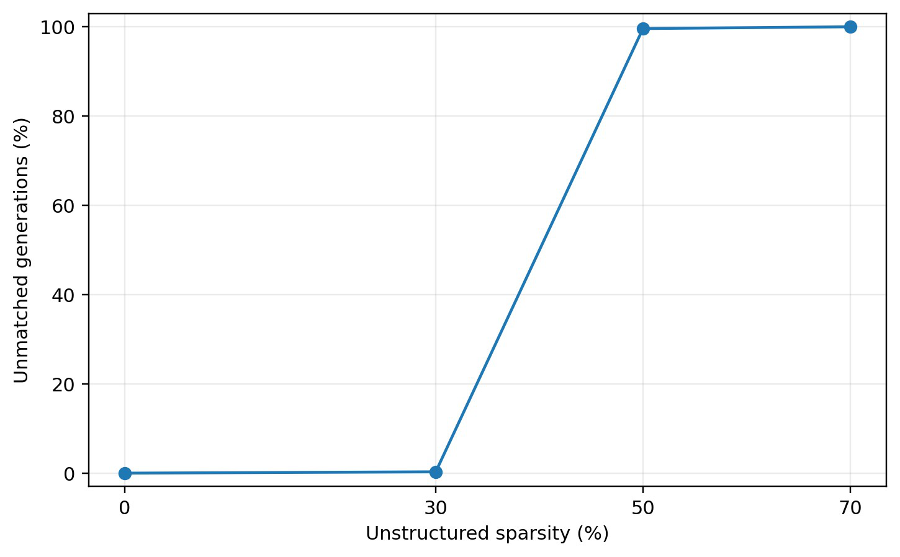

Figure 10. Invalid/unmatched generation rate across the pruning sweep. Generation-format failure rises from 0.3% at 30% sparsity to 99.6% at 50% and 100% at 70%.

### 7.6 Pruning efficiency and the quality-efficiency trap

Table 6 and Figure 11 report pruning efficiency with the device-placement caveat. Efficiency measurements must be interpreted together with model validity. The 30%-sparse model has a median latency of 1.002 s and estimated energy use of 0.002975 kWh for the fixed 100-example workload, while retaining only 63.95% accuracy. The 50% and 70% models appear faster and slightly lower-energy than the FP16 reference, but these measurements coincide with near-total or total functional collapse: almost all generations are invalid and therefore often terminate with short, unusable outputs. Device placement also differed: the 30%-sparse model was split approximately evenly across two T4s, whereas the 50% and 70% variants resided primarily on GPU 0. Consequently, their latency and memory measurements are retained for transparency but are not treated as evidence that higher unstructured sparsity intrinsically accelerates this model.

Table 6. Pruning runtime, memory, and CodeCarbon estimates. Values at 50-70% sparsity are not directly comparable as speedups because predictive behavior collapsed and device placement differed.

| Variant | Median latency (s) | Throughput (/s) | Peak allocated GPU (GB) | 100-sample runtime (s) | Energy (kWh) | CO2e (g) |
| --- | --- | --- | --- | --- | --- | --- |
| FP16 reference | 0.782 | 1.271 | 5.769 | 84.40 | 0.002609 | 1.181 |
| Pruned 30% | 1.002 | 0.995 | 2.895* | 101.98 | 0.002975 | 1.346 |
| Pruned 50% | 0.754 | 1.325 | 5.769* | 76.96 | 0.002516 | 1.139 |
| Pruned 70% | 0.782 | 1.276 | 5.827* | 74.53 | 0.002447 | 1.107 |

*Peak allocated value shown for the busiest GPU. The 30% model was distributed across both T4s (approximately 2.90 GB peak allocated on each), while the 50% and 70% models were primarily resident on GPU 0. These rows are therefore descriptive rather than a controlled sparsity-speed comparison.

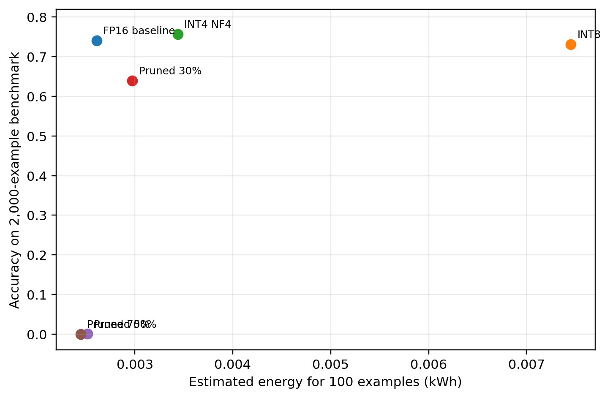

Figure 11. Accuracy versus estimated energy for the precision and pruning variants. The low-energy 50% and 70% pruning points are unusable because their classification behavior has collapsed; efficiency cannot be interpreted independently of quality.

### 7.7 Knowledge distillation and hard-label ablation

Table 7 and Figure 12 compare the students and teacher. The distilled DistilBERT student achieves 77.35% accuracy, 0.7630 macro F1, and 0.7716 weighted F1 on the fixed 2,000-example benchmark, with no unmatched outputs. This exceeds the FP16 teacher by 3.25 percentage points in accuracy and 0.0305 macro F1 on the same subset. It also exceeds the otherwise matched hard-label-only DistilBERT, which reaches 76.40% accuracy and 0.7467 macro F1. The distilled objective therefore adds 0.95 percentage points of accuracy, 0.0163 macro F1, and 0.0165 weighted F1 relative to the hard-label control in this single run. Because only one training run is available for each student, the ablation should be interpreted as evidence of an incremental benefit in this experiment rather than a seed-averaged causal estimate.

Table 7. Cross-method predictive quality on the fixed 2,000-example stratified benchmark.

| Variant | Parameters | Accuracy | Macro F1 | Weighted F1 | Unmatched |
| --- | --- | --- | --- | --- | --- |
| FP16 Qwen teacher | 3.086B | 0.7410 | 0.7325 | 0.7311 | - |
| INT8 Qwen | 3.086B | 0.7310 | 0.7232 | 0.7232 | - |
| INT4 NF4 Qwen | 3.086B | 0.7565 | 0.7497 | 0.7490 | - |
| Pruned 30% Qwen | 3.086B dense | 0.6395 | 0.6333 | 0.6318 | 6 |
| Pruned 50% Qwen | 3.086B dense | 0.0005 | 0.0014 | 0.0010 | 1992 |
| Pruned 70% Qwen | 3.086B dense | 0.0000 | 0.0000 | 0.0000 | 2000 |
| Hard-label DistilBERT | 66.96M | 0.7640 | 0.7467 | 0.7551 | 0 |
| Distilled DistilBERT | 66.96M | 0.7735 | 0.7630 | 0.7716 | 0 |

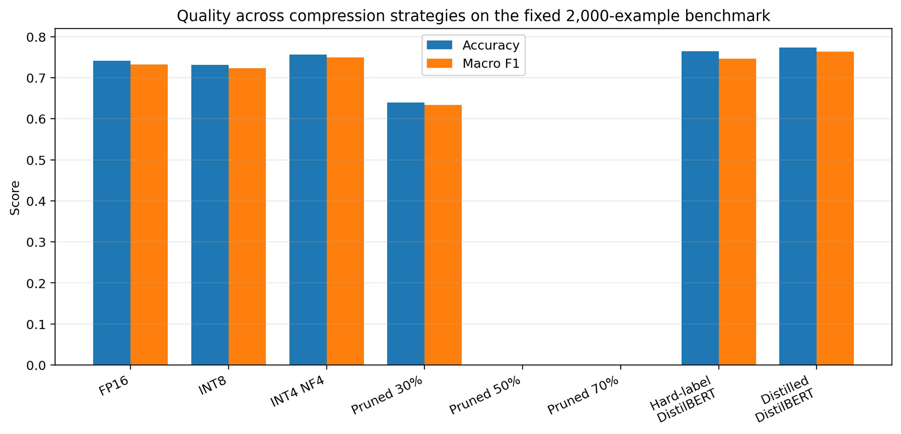

Figure 12. Accuracy and macro F1 across quantization, pruning, and DistilBERT variants on the same fixed 2,000-example benchmark. The distilled student achieves the highest observed accuracy and macro F1, while one-shot pruning collapses beyond 30% sparsity.

### 7.8 Student deployment efficiency and footprint

Table 8 and Figures 13–14 present the task-specific efficiency record. The distilled student changes the deployment regime substantially. It contains 66.96M parameters versus 3.086B in the teacher (approximately 46.08x fewer), and its serialized checkpoint is 0.2501 GB (256.13 MB) versus 5.763 GB for the merged FP16 teacher, a reduction of approximately 95.7%. After clearing training objects and reloading only the student, peak allocated GPU memory is 0.2681 GB on GPU 0, roughly 95.4% below the FP16 teacher's 5.769 GB measurement. Formal single-example latency is 4.40 ms mean and 4.38 ms median, corresponding to 227.36 samples/s, while the 2,000-example benchmark completes in 9.06 s (220.72 samples/s). These speed differences reflect both model scale and a change from autoregressive label generation to direct sequence classification.

For the identical 100-example energy workload, the distilled student completes inference in 0.497 s. CodeCarbon estimates 1.413e-5 kWh and 6.397e-6 kg CO2e (0.0064 g), approximately 99.46% lower estimated operational energy than the FP16 teacher's 0.002609 kWh under these recorded runs. The very short student workload makes the estimate especially sensitive to CodeCarbon sampling granularity and background-system effects; the value is therefore treated as an indicative operational estimate rather than a high-precision power measurement.

Table 8. FP16 teacher versus distilled-student deployment measurements.

| Metric | FP16 Qwen teacher | Distilled DistilBERT |
| --- | --- | --- |
| Parameters | 3,085,938,688 | 66,961,162 |
| Benchmark accuracy | 0.7410 | 0.7735 |
| Macro F1 | 0.7325 | 0.7630 |
| Checkpoint size | 5.763 GB | 0.2501 GB (256.13 MB) |
| Peak allocated GPU memory | 5.769 GB | 0.2681 GB |
| Single-example latency | 0.782 s median | 0.00440 s mean; 0.00438 s median |
| Formal throughput | 1.271 /s | 227.36 /s |
| 2k benchmark throughput | 0.976 /s | 220.72 /s |
| 100-sample runtime | 84.40 s | 0.497 s |
| Estimated energy | 0.002609 kWh | 1.413e-5 kWh |
| Estimated CO2e | 1.181 g | 0.0064 g |

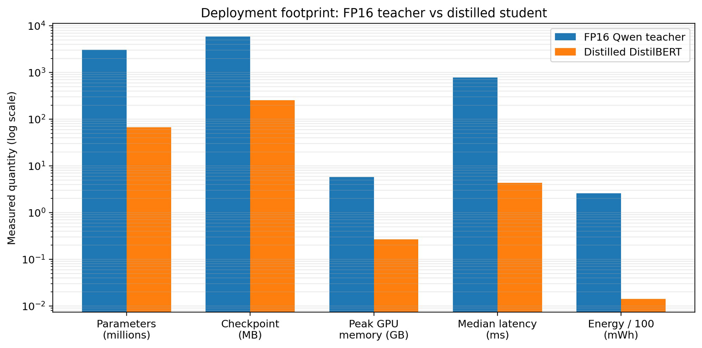

Figure 13. Deployment footprint of the FP16 Qwen teacher and distilled DistilBERT student. The log scale highlights reductions in parameter count, checkpoint size, allocated GPU memory, latency, and estimated energy; the comparison is end-to-end and includes the architectural shift from generation to classification. The inherited energy-axis label reads mWh, but the plotted energy values correspond to Wh per 100 examples (approximately 2.609 Wh for FP16 and 0.01413 Wh for the student). Tables 4 and 8 preserve the recorded kWh values; this caption clarifies the original unit label without altering the figure.

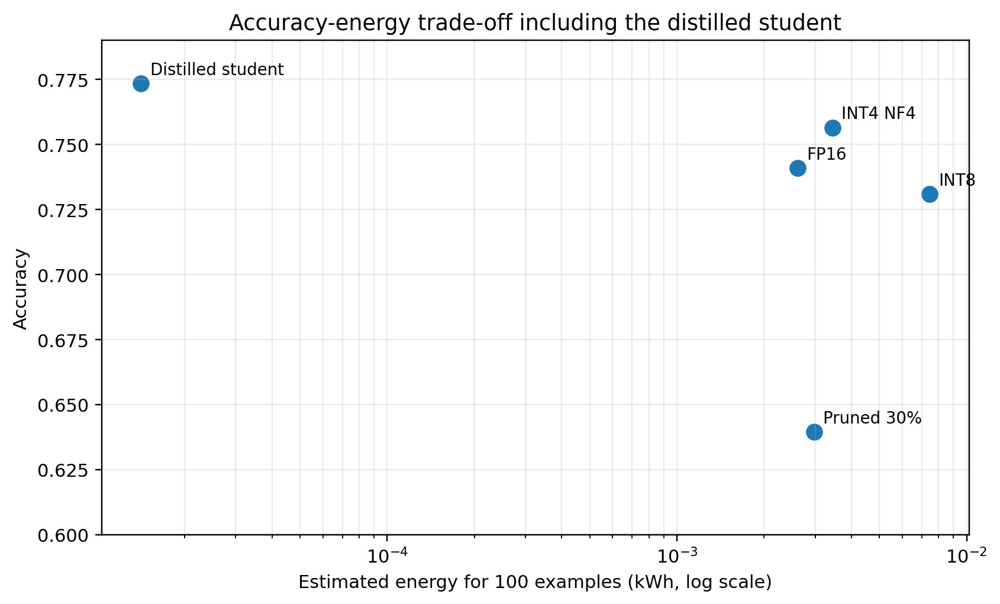

Figure 14. Accuracy-energy trade-off including the distilled student. The student occupies a distinct low-energy, high-accuracy region in this task-specific experiment, although its CodeCarbon estimate comes from a very short workload and should be interpreted cautiously.

### 7.9 Phase 11 Pareto synthesis: separate comparison scopes

Table 9 records the archived Pareto flags. The archived Pareto table contains five usable variants: FP16 Qwen, INT8 Qwen, INT4 NF4 Qwen, Pruned 30%, and distilled DistilBERT. It marks the four Qwen variants dominated and the distilled student non-dominated. The four-objective verification in Section 5.5 reproduces all five flags. The student has higher macro F1 and lower recorded median latency, memory, and estimated energy than each of the other four. The same task-specific ordering holds for the accuracy-latency and macro-F1-latency projections shown in Figure 15. This is a deployment-level finding, conditional on allowing a task-specific classifier.

Restricting the candidate set to Qwen changes the interpretation. FP16 and INT4 NF4 are both non-dominated in the quality-latency and quality-energy projections: FP16 is faster and lower-energy, while INT4 is higher-scoring. INT4 dominates INT8 on macro F1, latency, memory, and estimated energy. In the four-objective Qwen-only verification, Pruned 30% also remains formally non-dominated because it is faster than INT4 and has a lower reported per-GPU peak than FP16. That nominal survival is not a practical endorsement: accuracy falls to 63.95%, its checkpoint is unchanged, and its memory value is confounded by two-GPU placement. Thus INT4 is the strongest tested Qwen quality-memory option, not a universal winner over FP16 for every objective.

Table 9. Pareto status by candidate set and objective scope; results verified from saved metrics.

| Variant | Archived mixed-system flag | Qwen only: F1 + latency | Qwen only: F1 + latency + memory + energy |
| --- | --- | --- | --- |
| FP16 Qwen | Dominated | Non-dominated | Non-dominated |
| INT8 Qwen | Dominated | Dominated | Dominated |
| INT4 NF4 Qwen | Dominated | Non-dominated | Non-dominated |
| Pruned 30% | Dominated | Dominated | Non-dominated* |
| Distilled DistilBERT | Non-dominated | Outside scope | Outside scope |

*Pruned 30% has a device-placement confound and substantially degraded quality. Pruned 50%/70% are excluded as unusable; hard-label DistilBERT lacks the required complete efficiency record. Dominance is conditional on the listed objectives and candidates, not an architecture-independent capability ranking.

Table 10. Phase 11 changes relative to FP16; negative reductions indicate greater resource use.

| Variant | Accuracy Δ (pp) | Macro F1 Δ | Memory reduction (%) | Energy reduction (%) |
| --- | --- | --- | --- | --- |
| FP16_Qwen | +0.00 | +0.00000 | 0.00 | 0.00 |
| INT8_Qwen | -1.00 | -0.00931 | 43.75 | -185.60 |
| INT4_NF4_Qwen | +1.55 | +0.01719 | 65.77 | -31.81 |
| Pruned_30 | -10.15 | -0.09920 | 49.81 | -14.02 |
| Distilled_DistilBERT | +3.25 | +0.03046 | 95.35 | 99.46 |
| HardLabel_DistilBERT | +2.30 | +0.01419 | Not reported | Not reported |

Table 10 gives the FP16-relative changes. For Qwen, INT8 reduces the reported peak memory by 43.75% but increases estimated energy by 185.60%; INT4 reduces memory by 65.77% but increases energy by 31.81%. Pruned 30% loses 10.15 accuracy points and 0.09920 macro F1, with a 14.02% energy increase. Its apparent 49.81% per-GPU memory reduction must not be equated with total-device memory savings. Separately, the distilled student gains 3.25 accuracy points and 0.03046 macro F1 over FP16, with 95.35% lower reported memory and 99.46% lower estimated energy. The hard-label student gains 2.30 points and 0.01419 macro F1 over FP16; its formal throughput is 223.4243109001946 samples/s. The distilled-minus-hard-label gains are 0.95 points accuracy, 0.0162722193785275 macro F1, and 0.0164616407371041 weighted F1 (approximately 0.01627 and 0.01646 in the Phase 11 summary).

### 7.10 Phase 11 rare-category findings

Table 11. Supplied per-class F1 on the fixed benchmark (source precision: two decimals).

| Variant | Missing/found F1 | Urgent-needs F1 |
| --- | --- | --- |
| FP16_Qwen | 0.88 | 0.51 |
| INT8_Qwen | 0.88 | 0.49 |
| INT4_NF4_Qwen | 0.88 | 0.52 |
| Pruned_30 | 0.94 | 0.5 |
| Distilled_DistilBERT | 0.84 | 0.55 |

Table 11 reports the two available class-level F1 measures. Missing/found F1 remains 0.88 under FP16, INT8, and INT4, increases to 0.94 with 30% pruning, and decreases to 0.84 for distilled DistilBERT. Relative to FP16, urgent-needs F1 changes from 0.51 to 0.49 for INT8, 0.52 for INT4, 0.50 for Pruned 30%, and 0.55 for the distilled student. The pattern does not support a blanket claim that compression disproportionately harms rare humanitarian categories. It also does not prove rare-class robustness: nine missing/found examples make small prediction changes influential, the supplied F1 values are rounded, and no corresponding hard-label-student or collapsed-pruning class scores are supplied.

### 7.11 Phase 12 visualizations and normalized deployment costs

Figures 15-17 reproduce all three supplied Phase 12 visualizations. The plotting data also retain the unusable pruning rows and the partially measured hard-label row; those records remain in Appendix C even where the figures omit them. No plotted omission is treated as a zero value.

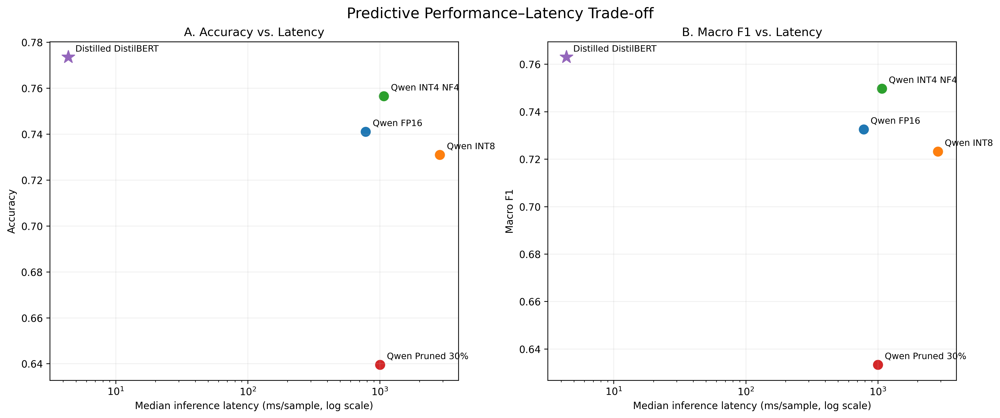

Figure 15. Phase 12 performance versus median latency (logarithmic x-axis): accuracy at left, macro F1 at right. Five usable variants with measured median latency are shown. Distilled DistilBERT is the non-dominated task-specific point; the Qwen-only performance-latency frontier contains FP16 and INT4 NF4. The architectures use different inference procedures.

The distilled student has a recorded median latency of 4.378193500087946 ms versus 782 ms for FP16, approximately 99.44% lower. Its 4.40 ms mean latency and 227.36 samples/s formal throughput remain distinct measurements. The Phase 12 latency plot uses the median and does not replace the mean-based reporting in Phase 10.

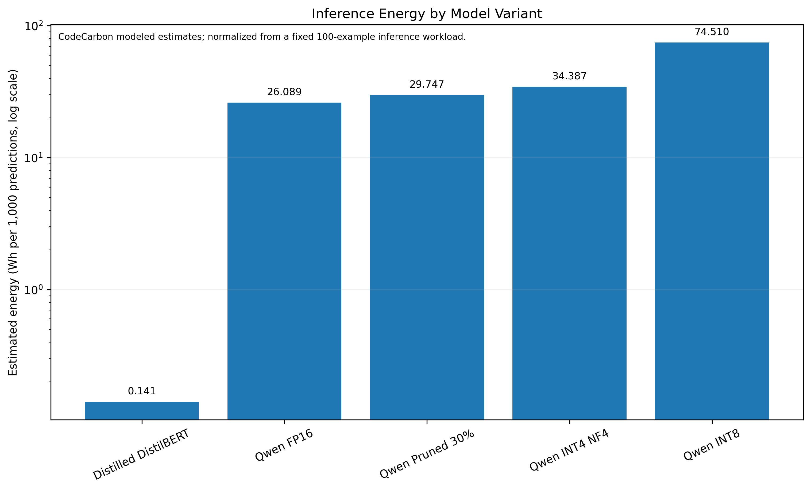

Figure 16. Phase 12 energy estimates normalized to Wh per 1,000 predictions from the same 100-example workload; logarithmic y-axis. Usable variants are shown. This is a scaling of CodeCarbon estimates, not a new workload measurement or direct power-meter reading. Cross-architecture and device-placement caveats apply.

The normalized estimates are 26.08865 Wh/1,000 for FP16, 74.51009 for INT8, 34.38705 for INT4, 29.74727 for Pruned 30%, and 0.14132846 for distilled DistilBERT. The archived unusable Pruned 50% and Pruned 70% rows are 25.16000 and 24.46858 Wh/1,000, respectively; they are not usable energy-efficiency successes. The student estimate is approximately 99.46% below FP16, subject to the 0.497 s energy-run limitation. Among usable Qwen variants, energy increases in the order FP16, Pruned 30%, INT4, INT8.

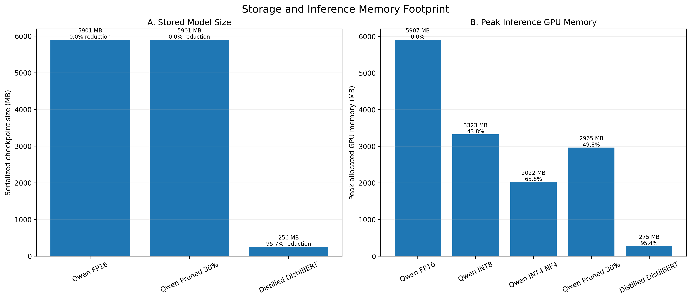

Figure 17. Phase 12 checkpoint size (left) and peak allocated GPU memory (right). Original MB labels use the source GB ×1,024 convention. FP16 and Pruned 30% have equal dense checkpoint size; quantized disk sizes were not measured. Pruned 30% memory is the busiest-GPU peak in a two-GPU run, not total GPU memory. The DistilBERT comparison is task-specific.

The source-convention checkpoint sizes are 5901.312 MB for both FP16 and Pruned 30%, and 256.129024 MB for distilled DistilBERT, a 95.66% reduction. Peak allocated values are 5907.456 MB for FP16, 3322.88 MB for INT8, 2022.4 MB for INT4, 2964.8896 MB for Pruned 30%, and 274.5344 MB for the distilled student. The complete plotting record additionally includes 5907.2512 MB for Pruned 50% and 5967.1552 MB for Pruned 70%. The original measurements in GB and the exact supplied derived fields are retained in Appendix C.

## 8. Discussion

### 8.1 Compression is multi-objective

The central finding is that nominal compression is not synonymous with usable efficiency, and that the best strategy depends on whether the deployment must preserve the original generative architecture. Low-bit quantization reduces memory while largely preserving Qwen task quality, although its latency and energy depend strongly on the T4/bitsandbytes execution path. Unstructured pruning behaves differently: at 30% sparsity it causes a large quality loss without reducing dense checkpoint size, and at 50-70% it yields apparently cheap inference only because the classifier has functionally collapsed. Knowledge distillation changes the architecture and objective, but for this fixed classification task it produces the strongest measured quality-efficiency point: the 66.96M-parameter student exceeds the teacher and hard-label control on accuracy while sharply reducing memory, storage, latency, and estimated energy. Compression must therefore be evaluated jointly across quality, deployment function, memory, latency, energy, storage, and architectural constraints.

### 8.2 Interpreting the INT4 quality result

INT4 NF4 is the highest-scoring precision variant on the fixed 2,000-example benchmark. The difference is supported by paired correctness counts, but the mechanism should not be overinterpreted. Quantization can perturb decision boundaries and occasionally correct baseline errors while introducing different errors elsewhere. The QLoRA literature also shows that NF4 preserves information better than naive 4-bit formats for normally distributed pretrained weights [5]. Still, the present experiment does not establish a general accuracy-improving effect of INT4. Replication across additional stratified samples, tasks, seeds, and hardware/software stacks is needed.

### 8.3 Error structure and class imbalance

Across the full test set, the fine-tuned model performs strongly on injured/dead people and several operational categories, but the “other relevant information” class remains difficult. This class is both broad and common, making its boundary inherently less specific than categories such as casualties or evacuations. The rare missing/found class also deserves caution because small absolute changes can produce large metric shifts. These observations justify retaining macro F1 and per-class analysis as headline measures rather than relying on accuracy alone. Phase 11 adds direct evidence that the direction of rare-category change depends on both the compression method and category (Table 11). Aggregate gains can coexist with lower missing/found F1, as in the distilled student, while urgent-needs F1 improves. The nine-example missing/found support rules out strong general claims from this descriptive comparison.

### 8.4 Quantization versus pruning

Under the matched 2,000-example benchmark, quantization preserves predictive quality far more effectively than one-shot magnitude pruning. INT8 is only 1.00 percentage point below FP16 accuracy, while INT4 NF4 is 1.55 points above FP16 in this specific benchmark. By comparison, 30% pruning loses 10.15 points and 50% pruning collapses almost completely. The comparison does not imply that pruning is generally inferior: structured pruning, sparsity-aware kernels, iterative pruning, and recovery fine-tuning could produce different outcomes. It does show that naive one-shot unstructured sparsification is a poor drop-in substitute for low-bit quantization for this model, task, and hardware/software stack.

### 8.5 Green AI implication

The Green AI framing is reinforced by the result that an apparently compressed representation is not automatically the lowest-energy usable system. If only model precision or sparsity were reported, the trade-offs would be misleading. Under the measured T4/bitsandbytes path, FP16 is faster and lower-energy than the runtime-quantized Qwen variants despite their memory savings, while one-shot pruning fails to provide a usable quality-efficiency benefit. The distilled classifier, by contrast, reduces the task-specific deployment footprint by changing both scale and architecture. This illustrates why efficiency should be measured rather than inferred from bit width, zero fraction, or parameter count alone [1]. The observed student reductions relative to FP16—99.44% median latency, 95.35% peak GPU memory, 95.66% checkpoint size, and 99.46% estimated inference energy—describe this task-specific deployment boundary. They do not include the energy cost of creating the student or demonstrate an end-to-end lifecycle saving. Figures 15–17 connect quality to these resource dimensions; retaining failed and incomplete runs prevents selective efficiency claims.

### 8.6 Interpreting the distillation result

The distilled student is the highest-scoring model on the fixed benchmark, but it is not a drop-in compressed version of Qwen. It is a task-specialized classifier with a different tokenizer, encoder architecture, output head, and inference procedure. Its advantage therefore combines architectural specialization, much smaller scale, and teacher supervision. The hard-label ablation helps separate these factors: an otherwise matched DistilBERT trained without soft targets reaches 76.40% accuracy and 0.7467 macro F1, while the distilled model reaches 77.35% and 0.7630. This 0.95-point accuracy and 0.0163 macro-F1 gain is consistent with useful teacher information in this run, but repeated seeds would be needed to estimate the effect robustly. The result should therefore be stated as task-specific evidence for distillation, not as proof that a 67M classifier generally surpasses a 3B instruction model.

### 8.7 Deployment choice after Pareto synthesis

The Phase 11 flags and Phase 12 plots answer a constrained deployment question. If generation and the Qwen architecture must be retained, INT4 is attractive for memory-constrained use, while FP16 remains preferable when the observed latency and energy costs dominate. If deployment permits a ten-class encoder classifier, the distilled student is the strongest fully measured point in this experiment. The hard-label student remains an important quality ablation, but its missing resource measurements prevent a complete comparison of the two students across all deployment objectives. A frontier describes the supplied measurements and chosen objectives; it does not establish safety, reliability across disasters, or universal model superiority.

### 8.8. Direct answers to the research questions

RQ1: QLoRA achieves 73.84% accuracy and 0.7205 macro F1 on all 8,030 test examples, compared with the post-hoc matched TF-IDF/logistic-regression test control at 71.30% and 0.6965. The gains are 2.54 percentage points and 0.0240 macro F1; the full-test and 2,000-example results must not be interchanged.

RQ2: Relative to FP16 accuracy 74.10% and macro F1 0.732505725427883, INT8 gives 73.10% and 0.7232, whereas INT4 gives 75.65% and 0.7497. The inherited exact McNemar p-values are 0.0119 and 0.0090, respectively. Thus the tested four-bit configuration does not cross an observed quality-degradation threshold; INT8 exhibits a statistically detectable one-percentage-point loss on this sample, whose practical acceptability was not prespecified.

RQ3: INT8 and INT4 reduce recorded peak GPU memory by 43.75% and 65.77%, but raise median latency from 0.782 s to 2.849 s and 1.074 s and increase estimated energy by 185.60% and 31.81%. Their separate disk sizes are unreported. FP16 is preferable when the observed Qwen latency/energy objective dominates; INT4 is preferable when quality and memory are the binding constraints. Throughput and CO2e values remain in the complete record rather than being inferred from rounded latency.

RQ4: A major observed quality loss already occurs at the lowest tested pruning level: 30% sparsity loses 10.15 accuracy percentage points and 0.09920346547967862 macro F1. Functional collapse is bracketed between the tested 30% and 50% levels; 50% gives 0.05% accuracy and 99.6% unmatched generations, and 70% has zero accuracy with all generations unmatched. This is not an estimate of the exact maximum tolerable sparsity. The 30% dense checkpoint remains 5.763 GB; nominal zeroing supplies no demonstrated storage benefit.

RQ5: The distilled student reaches 77.35% accuracy and 0.7629680730982821 macro F1 versus 76.40% and 0.7466958537197546 for hard-label training. The observed soft-target increments are 0.95 accuracy percentage points and approximately 0.01627 macro F1. Without repeated training runs they do not establish a general causal benefit beyond the matched ablation. DistilBERT changes architecture and replaces generation with direct task classification.

RQ6: Distilled DistilBERT is the sole non-dominated system in the complete-case task-specific comparison. Qwen-only quality/latency and quality/energy frontiers contain FP16 and INT4. The four-objective Qwen-only frontier additionally retains Pruned_30, conditional on the recorded per-GPU memory metric; its poor quality and multi-GPU placement prevent a practical endorsement. INT8 is dominated by INT4. These conclusions are conditional on candidate set, usability filtering, available objectives, and measurement scope.

RQ7: Missing/found F1 is 0.88 for FP16, INT8, and INT4, 0.94 for Pruned_30, and 0.84 for the distilled student. Urgent-needs F1 is 0.51, 0.49, 0.52, 0.50, and 0.55, respectively. The directions are mixed rather than uniformly harmful. Nine missing/found examples, absent urgent-needs support, and absent class confusion counts rule out strong rare-class generalization claims.

### 8.9. Cautious future work

Further evidence could test repeated seeds and paired prediction-level uncertainty, finer pruning levels with recovery tuning, structured or sparse-kernel implementations, matched single-device memory measurement, and event-disjoint or additional-task evaluation. Longer energy windows with a direct power meter and fully recorded CodeCarbon configuration would improve energy attribution. These are proposed extensions, not incomplete stages of the present report or claimed results.

## 9. Threats to Validity and Limitations

Single hardware profile. Results were obtained on a Kaggle environment with two Tesla T4 GPUs available; execution was primarily on GPU 0. Newer GPUs with native low-precision kernels may change the latency and energy ranking.

Runtime quantization rather than serialized checkpoints. INT8 and INT4 were loaded through bitsandbytes from the same merged FP16 source. Separate on-disk sizes are therefore not reported.

Subset for matched precision comparison. The full test set contains 8,030 examples, but the direct three-way quality benchmark uses a fixed stratified subset of 2,000 to control compute cost. The full test result is available for the fine-tuned baseline only.

One task and one model family. The study evaluates Qwen2.5-3B-Instruct on HumAID. Conclusions should not be generalized to other model sizes, architectures, languages, or generation tasks without replication.

Estimated energy and carbon. CodeCarbon estimates energy and CO2e from hardware and grid-intensity models; these values are not direct physical power measurements [7].

Generation-based classifier. The LLM produces text labels autoregressively rather than using a dedicated classification head, so decoding and prompt design contribute to latency and may affect output validity.

No repeated training seeds. The final adapter represents one completed fine-tuning run. Training-seed variability has not yet been quantified.

Social-media noise and label ambiguity. HumAID contains short, noisy, and semantically overlapping posts; broad categories such as other relevant information can be intrinsically ambiguous.

Pruning method scope. The pruning sweep uses one-shot layer-wise unstructured magnitude pruning without recovery fine-tuning. The observed cliff therefore characterizes this intervention, not pruning in general. Iterative pruning, global thresholds, structured removal, or post-pruning fine-tuning may shift the failure boundary.

Device-placement confound for pruning efficiency. The 30%-sparse model was distributed across two T4s, whereas the 50% and 70% models were placed primarily on a single T4 after storage and loading constraints. In addition, collapsed models often generated short invalid outputs. For these reasons, 50- 70% latency, memory, and energy values are reported descriptively but are not used to claim causal speedups from sparsity.

Dense storage limitation. A serialized 30%-sparse model remained 5.763 GB, equal to the original dense model. Because unstructured zeros are stored as ordinary FP16 values in dense safetensors, this experiment does not demonstrate deployable file-size compression. Sparse storage formats and compatible kernels would be required to realize that benefit.

Cross-architecture comparability. DistilBERT performs direct sequence classification while Qwen produces labels autoregressively. The large latency and energy gap is therefore an end-to-end deployment comparison, not a controlled comparison of two implementations of the same architecture. The student also forfeits the teacher's general generative capabilities.

Teacher soft-target approximation. Because Qwen has no ten-class classification head, teacher targets are obtained by scoring the complete allowed label sequences, averaging token log-probabilities within each label, and normalizing the ten scores. This is more faithful than using only each label's first token, but it remains an engineered proxy for a native categorical teacher distribution.

Single-run distillation ablation. The distilled and hard-label students were each trained once. Their 0.95-point accuracy gap may partly reflect optimization or initialization variance; repeated seeds and confidence intervals would strengthen causal claims about the value of teacher soft targets.

Short energy workload for the student. The fixed 100-example student run lasts approximately 0.5 s, which is very short for software-based energy estimation. CodeCarbon values are retained for consistency with earlier phases, but a longer repeated workload or external power meter would provide a more stable estimate.

Rare-class uncertainty. The missing/found benchmark support is only nine, and the new backups contain rounded F1 values rather than class-level prediction or confusion records. Neither rare-class significance nor disproportionate harm across all minority categories can be established from these two categories.

Pareto specification and incomplete data. The Phase 11 archive includes flags but no generating code or objective definition. The explicitly stated four-objective check reproduces those flags; alternative candidate sets and objectives can yield different frontiers. Missing hard-label resource metrics and missing quantized checkpoint sizes are not imputed. No confidence intervals for the frontier or repeated benchmark estimates are available.

Visualization and numerical precision. Phase 12 rescaling does not create new measurements. GB-to-MB fields follow the source ×1,024 convention, and the underlying byte divisor is not independently documented in these backups. Long decimal strings record artifact precision, not measurement certainty. The busiest-GPU pruning memory measurement is not comparable to aggregate multi-GPU memory consumption.

## 10. Reproducibility and Artifact Record

The manuscript is backed by saved processed splits, notebooks for dataset exploration, preprocessing, and the classical baseline, the final QLoRA adapter, Phase 6 test predictions and reports, Phase 7 quantization metadata, Phase 8 benchmark/energy artifacts, Phase 9 pruning result files, and a complete Phase 10 distillation backup. Phase 10 records the 37,471 x 10 teacher soft-label matrix, the distilled and hard-label DistilBERT checkpoints, exact benchmark predictions and metrics, training configuration and losses, formal latency trials, clean GPU-memory measurements, checkpoint size, and CodeCarbon outputs. The final Phase 10 archive is approximately 474 MB because it retains both student checkpoints in addition to result artifacts. This Phase 13 report directly audits the supplied Phase 10 manuscript and the Phase 11 and Phase 12 backups. At the time of the Phase 13 audit, the earlier notebooks, checkpoints, raw predictions, and Phase 10 archive described in the baseline manuscript were not supplied with that revision. Phase 8-12 execution notebooks were subsequently recovered and added to the repository without re-running the experiments; large checkpoints and raw archives remain excluded.

The completed Phase 11 record consists of master_comparison.csv (eight models), usable_model_deltas.csv (six usable models), pareto_analysis.csv (five complete usable models), rare_class_comparison.csv (five models and two class F1 fields), and PHASE11_SUMMARY.txt. The completed Phase 12 record consists of phase12_plot_data.csv (eight models), plot_summary.md, and PNG/PDF pairs for 01_performance_vs_latency, 02_energy_comparison, and 03_size_memory_comparison. Shared model identifiers join the records; missing cells remain missing. Appendix C preserves every supplied metric field, including unusable models and the incomplete ablation.

The supplied CSV summaries are sufficient to recheck metric joins, FP16-relative arithmetic, the stated complete-case Pareto verification, and Phase 12 plotting transformations without rerunning inference. Reproducing the underlying experiments requires benchmark_2000.csv, energy_sample_100.csv, the processed splits, original evaluation code, checkpoints, adapter, raw predictions, energy logs, and a software environment that are described historically but absent from these supplied backups. Table 12 records completed study stages; the accompanying phase13_evidence_audit.md inventories the evidence actually inspected. Metric-level verification therefore does not imply end-to-end experimental reproducibility. The three Phase 12 figures retain the supplied assets.

Table 12. Completed manuscript-stage record, updated from the Phase 10 status table.

| Stage | Status through Phase 12 | Retained or integrated evidence |
| --- | --- | --- |
| Magnitude pruning (30/50/70%) | Completed | Quality, latency, throughput, memory, dense-size limitation, energy, CO2e |
| Knowledge-distilled student | Completed | Student size, hard-label ablation, quality, latency, memory, checkpoint size, energy, CO2e |
| Final Pareto comparison (Phase 11) | Completed | Common metric record, usable deltas, Pareto flags, rare-class findings; separate comparison scopes |
| Visualizations (Phase 12) | Completed | Performance-latency, energy, and size-memory figures; exact plot-data record |

## 11. Conclusion

On the measured task, architecture-preserving Qwen inference can be reduced to tested INT4 NF4 without an observed quality loss: accuracy rises from 74.10% to 75.65%, while peak GPU memory falls by 65.77%. This is the strongest tested Qwen quality–memory configuration, but FP16 retains lower observed latency and estimated energy. INT8 loses one accuracy percentage point and is dominated by INT4 under the stated objectives. By contrast, naive unstructured pruning already loses 10.15 accuracy percentage points at 30% sparsity, leaves the dense checkpoint at 5.763 GB, and collapses at 50% and 70%. The data bracket a failure region rather than identify a universal or prespecified practical degradation threshold. The complete-test QLoRA result remains 73.84% accuracy on 8,030 examples. When a different task-specific architecture is allowed, distilled DistilBERT is the strongest measured deployment option: 77.35% accuracy, 0.7630 macro F1, a 256.13 MB checkpoint under the source unit convention, 0.268 GB recorded peak GPU memory, approximately 4.4 ms single-example latency, and 99.46% lower estimated inference energy than FP16. Its sole non-dominated status in the five-model complete-case comparison does not establish general superiority over generative Qwen. Rare-class outcomes remain mixed and support-limited. These findings answer the core compression question only for this dataset, tested levels, hardware, and operational-energy boundary. Repeated-run, additional-task, and better-instrumented energy evaluation are cautious extensions; no unmeasured robustness or lifecycle saving is claimed.

## References

[1] R. Schwartz, J. Dodge, N. A. Smith, and O. Etzioni, “Green AI,” arXiv:1907.10597, 2019. https://arxiv.org/abs/1907.10597

[2] F. Alam, U. Qazi, M. Imran, and F. Ofli, “HumAID: Human-Annotated Disaster Incidents Data from Twitter with Deep Learning Benchmarks,” Proceedings of the International AAAI Conference on Web and Social Media, vol. 15, no. 1, pp. 933-942, 2021. doi:10.1609/icwsm.v15i1.18116. https://doi.org/10.1609/icwsm.v15i1.18116

[3] Qwen Team et al., “Qwen2.5 Technical Report,” arXiv:2412.15115, 2024. https://arxiv.org/abs/2412.15115

[4] E. J. Hu et al., “LoRA: Low-Rank Adaptation of Large Language Models,” arXiv:2106.09685, 2021. https://arxiv.org/abs/2106.09685

[5] T. Dettmers, A. Pagnoni, A. Holtzman, and L. Zettlemoyer, “QLoRA: Efficient Finetuning of Quantized LLMs,” Advances in Neural Information Processing Systems, 2023; arXiv:2305.14314. https://arxiv.org/abs/2305.14314

[6] T. Dettmers, M. Lewis, Y. Belkada, and L. Zettlemoyer, “LLM.int8(): 8-bit Matrix Multiplication for Transformers at Scale,” Advances in Neural Information Processing Systems, 2022; arXiv:2208.07339. https://arxiv.org/abs/2208.07339

[7] CodeCarbon, “CodeCarbon Documentation: Track and Reduce CO2 Emissions from Computing,” software documentation, accessed Aug. 2026. https://docs.codecarbon.io/

[8] G. Hinton, O. Vinyals, and J. Dean, “Distilling the Knowledge in a Neural Network,” arXiv:1503.02531, 2015. https://arxiv.org/abs/1503.02531

## Appendix A. Label Set

injured_or_dead_people

rescue_volunteering_or_donation_effort

sympathy_and_support

infrastructure_and_utility_damage

not_humanitarian

caution_and_advice

displaced_people_and_evacuations

requests_or_urgent_needs

missing_or_found_people

other_relevant_information

## Appendix B. Evidence Preservation and Revision Record

The supplied Phase 10 PDF is the baseline. All validated Phase 1-10 methods, experiments, measured tables, figure assets, metrics, and substantive conclusions have been retained in this Phase 13 revision. Tables 1-8 and Figures 1-14 preserve their original numbering and values. Table 12 updates the former planned-stage record to completed status; the obsolete next-stage section and continuation instructions have been replaced by completed methods, results, interpretation, and reproducibility reporting. Tables 9-11 and Figures 15-17 contain the new synthesis and visualizations. The DOCX is the editable manuscript; the PDF is rendered from it. The existing Phase 12 DOCX was edited directly; it was not reconstructed from the PDF. Tables formerly labeled C1–C8 are now Tables 13–20 to maintain sequential numbering. Their cells and all 17 original figure assets are unchanged.

Edits to earlier wording clarify scope rather than overwrite findings: the energy minimum in Section 7.4 refers to the three Qwen precision variants, Figure 11 covers precision and pruning, and the original pipeline figure remains a Phase 1-10 record. Rounded results in the baseline are retained alongside the higher-precision CSV record. Author and institution metadata were subsequently supplied by Mayuresh Sharma. The authors are Mayuresh Sharma and Aditya Chauhan, both at GGSIPU, New Delhi. This administrative update does not change any experimental claim. No new training result, missing resource value, class support, significance test, or software version has been invented.

research_paper_through_phase10(3).pdf - SHA-256: 48e6e814502ec5fd6d3327f28c4c8bd07a0b7c6ecc60b8af5af7e69a66d5497c

phase11-final-backup(2).zip - SHA-256: e0a2f6cbf6b6b523f5f541b08159203fa1ca213f7bd0735d05a7d580c78ae9fd

phase12-final-backup(2).zip - SHA-256: 60e8d1495fedfae606a2ef451daaad0d2b6a6c130e36691251ce9e01a46fb5d4

## Appendix C. Complete Phase 11-12 Metric Record

The following model records transcribe every field in master_comparison.csv and all additional fields in usable_model_deltas.csv, rare_class_comparison.csv, pareto_analysis.csv, and phase12_plot_data.csv. Shared columns are represented once at the master-record precision; Phase 12 serialization-only rounding differences in repeated fields are not new measurements. Values are source strings. “Not reported” corresponds to a blank or absent field; “not included” identifies absence from the archived Pareto table. Derived plotting units preserve the source labels and ×1,024 convention. Accuracy and unmatched rate are fractions; F1 has range 0-1. Model family and usable status are retained verbatim. Tables 13–20 give the complete records for FP16_Qwen, INT8_Qwen, INT4_NF4_Qwen, Pruned_30, Pruned_50, Pruned_70, Distilled_DistilBERT, and HardLabel_DistilBERT, respectively.

### C.1 FP16_Qwen

Table 13. Complete source record for FP16_Qwen.

| Source field | Recorded value |
| --- | --- |
| family | baseline |
| usable | True |
| accuracy | 0.741 |
| macro_f1 | 0.732505725427883 |
| weighted_f1 | 0.7310994656252274 |
| median_latency_s | 0.782 |
| throughput_sps | 1.271 |
| peak_gpu_memory_gb | 5.769 |
| energy_100_kwh | 0.0026088649956977 |
| co2_100_g | 1.1808264965973 |
| checkpoint_size_gb | 5.763 |
| parameters | 3085938688 |
| unmatched_rate | 0.0 |
| dominated (archived mixed-system scope) | True |
| accuracy_delta_pp | 0.0 |
| macro_f1_delta | 0.0 |
| memory_reduction_pct | 0.0 |
| energy_reduction_pct | 0.0 |
| missing_found_f1 | 0.88 |
| urgent_needs_f1 | 0.51 |
| latency_ms | 782.0 |
| peak_gpu_memory_mb | 5907.456 |
| checkpoint_size_mb | 5901.312 |
| energy_wh_per_1000 | 26.088649956977 |

### C.2 INT8_Qwen

Table 14. Complete source record for INT8_Qwen.

| Source field | Recorded value |
| --- | --- |
| family | quantization |
| usable | True |
| accuracy | 0.731 |
| macro_f1 | 0.7232 |
| weighted_f1 | 0.7232 |
| median_latency_s | 2.849 |
| throughput_sps | 0.351 |
| peak_gpu_memory_gb | 3.245 |
| energy_100_kwh | 0.0074510088901041 |
| co2_100_g | 3.3724814194397 |
| checkpoint_size_gb | Not reported |
| parameters | 3085938688 |
| unmatched_rate | 0.0 |
| dominated (archived mixed-system scope) | True |
| accuracy_delta_pp | -1.0000000000000009 |
| macro_f1_delta | -0.009305725427882994 |
| memory_reduction_pct | 43.7510833766684 |
| energy_reduction_pct | -185.6034674999135 |
| missing_found_f1 | 0.88 |
| urgent_needs_f1 | 0.49 |
| latency_ms | 2849.0 |
| peak_gpu_memory_mb | 3322.88 |
| checkpoint_size_mb | Not reported |
| energy_wh_per_1000 | 74.510088901041 |

### C.3 INT4_NF4_Qwen

Table 15. Complete source record for INT4_NF4_Qwen.

| Source field | Recorded value |
| --- | --- |
| family | quantization |
| usable | True |
| accuracy | 0.7565 |
| macro_f1 | 0.7497 |
| weighted_f1 | 0.749 |
| median_latency_s | 1.074 |
| throughput_sps | 0.929 |
| peak_gpu_memory_gb | 1.975 |
| energy_100_kwh | 0.0034387051172414 |
| co2_100_g | 1.5564293756555 |
| checkpoint_size_gb | Not reported |
| parameters | 3085938688 |
| unmatched_rate | 0.0 |
| dominated (archived mixed-system scope) | True |
| accuracy_delta_pp | 1.5499999999999958 |
| macro_f1_delta | 0.017194274572117085 |
| memory_reduction_pct | 65.76529727855781 |
| energy_reduction_pct | -31.80847314491919 |
| missing_found_f1 | 0.88 |
| urgent_needs_f1 | 0.52 |
| latency_ms | 1074.0 |
| peak_gpu_memory_mb | 2022.4 |
| checkpoint_size_mb | Not reported |
| energy_wh_per_1000 | 34.387051172414 |

### C.4 Pruned_30

Table 16. Complete source record for Pruned_30.

| Source field | Recorded value |
| --- | --- |
| family | pruning |
| usable | True |
| accuracy | 0.6395 |
| macro_f1 | 0.6333022599482043 |
| weighted_f1 | 0.6318104752816464 |
| median_latency_s | 1.001759561999961 |
| throughput_sps | 0.9949162372233542 |
| peak_gpu_memory_gb | 2.8954 |
| energy_100_kwh | 0.002974726862353 |
| co2_100_g | 1.3464231782782 |
| checkpoint_size_gb | 5.763 |
| parameters | 3085938688 |
| unmatched_rate | 0.003 |
| dominated (archived mixed-system scope) | True |
| accuracy_delta_pp | -10.150000000000004 |
| macro_f1_delta | -0.09920346547967862 |
| memory_reduction_pct | 49.81105910903103 |
| energy_reduction_pct | -14.023794533586287 |
| missing_found_f1 | 0.94 |
| urgent_needs_f1 | 0.5 |
| latency_ms | 1001.7595619999611 |
| peak_gpu_memory_mb | 2964.8896 |
| checkpoint_size_mb | 5901.312 |
| energy_wh_per_1000 | 29.747268623529994 |

### C.5 Pruned_50

Table 17. Complete source record for Pruned_50.

| Source field | Recorded value |
| --- | --- |
| family | pruning |
| usable | False |
| accuracy | 0.0005 |
| macro_f1 | 0.0013986013986013986 |
| weighted_f1 | 0.000986013986013986 |
| median_latency_s | 0.7536016564999954 |
| throughput_sps | 1.3254230991334082 |
| peak_gpu_memory_gb | 5.7688 |
| energy_100_kwh | 0.0025160002320851 |
| co2_100_g | 1.1387939753075 |
| checkpoint_size_gb | Not reported |
| parameters | 3085938688 |
| unmatched_rate | 0.996 |
| dominated (archived mixed-system scope) | Not included |
| accuracy_delta_pp | Not reported |
| macro_f1_delta | Not reported |
| memory_reduction_pct | Not reported |
| energy_reduction_pct | Not reported |
| missing_found_f1 | Not reported |
| urgent_needs_f1 | Not reported |
| latency_ms | 753.6016564999954 |
| peak_gpu_memory_mb | 5907.2512 |
| checkpoint_size_mb | Not reported |
| energy_wh_per_1000 | 25.160002320851 |

### C.6 Pruned_70

Table 18. Complete source record for Pruned_70.

| Source field | Recorded value |
| --- | --- |
| family | pruning |
| usable | False |
| accuracy | 0.0 |
| macro_f1 | 0.0 |
| weighted_f1 | 0.0 |
| median_latency_s | 0.7824434344993279 |
| throughput_sps | 1.276216289105717 |
| peak_gpu_memory_gb | 5.8273 |
| energy_100_kwh | 0.0024468577306169 |
| co2_100_g | 1.1074986426976 |
| checkpoint_size_gb | Not reported |
| parameters | 3085938688 |
| unmatched_rate | 1.0 |
| dominated (archived mixed-system scope) | Not included |
| accuracy_delta_pp | Not reported |
| macro_f1_delta | Not reported |
| memory_reduction_pct | Not reported |
| energy_reduction_pct | Not reported |
| missing_found_f1 | Not reported |
| urgent_needs_f1 | Not reported |
| latency_ms | 782.4434344993279 |
| peak_gpu_memory_mb | 5967.1552 |
| checkpoint_size_mb | Not reported |
| energy_wh_per_1000 | 24.468577306169 |

### C.7 Distilled_DistilBERT

Table 19. Complete source record for Distilled_DistilBERT.

| Source field | Recorded value |
| --- | --- |
| family | distillation |
| usable | True |
| accuracy | 0.7735 |
| macro_f1 | 0.7629680730982821 |
| weighted_f1 | 0.7715770921582532 |
| median_latency_s | 0.004378193500087946 |
| throughput_sps | 227.36370581025434 |
| peak_gpu_memory_gb | 0.2681 |
| energy_100_kwh | 1.4132845669886998e-05 |
| co2_100_g | 0.006396819562087144 |
| checkpoint_size_gb | 0.250126 |
| parameters | 66961162 |
| unmatched_rate | 0.0 |
| dominated (archived mixed-system scope) | False |
| accuracy_delta_pp | 3.2499999999999973 |
| macro_f1_delta | 0.030462347670399126 |
| memory_reduction_pct | 95.35274744323107 |
| energy_reduction_pct | 99.45827608200526 |
| missing_found_f1 | 0.84 |
| urgent_needs_f1 | 0.55 |
| latency_ms | 4.3781935000878995 |
| peak_gpu_memory_mb | 274.5344 |
| checkpoint_size_mb | 256.129024 |
| energy_wh_per_1000 | 0.14132845669886998 |

### C.8 HardLabel_DistilBERT

Table 20. Complete source record for HardLabel_DistilBERT.

| Source field | Recorded value |
| --- | --- |
| family | ablation |
| usable | True |
| accuracy | 0.764 |
| macro_f1 | 0.7466958537197546 |
| weighted_f1 | 0.7551154514211491 |
| median_latency_s | Not reported |
| throughput_sps | 223.4243109001946 |
| peak_gpu_memory_gb | Not reported |
| energy_100_kwh | Not reported |
| co2_100_g | Not reported |
| checkpoint_size_gb | Not reported |
| parameters | 66961162 |
| unmatched_rate | 0.0 |
| dominated (archived mixed-system scope) | Not included |
| accuracy_delta_pp | 2.300000000000002 |
| macro_f1_delta | 0.014190128291871607 |
| memory_reduction_pct | Not reported |
| energy_reduction_pct | Not reported |
| missing_found_f1 | Not reported |
| urgent_needs_f1 | Not reported |
| latency_ms | Not reported |
| peak_gpu_memory_mb | Not reported |
| checkpoint_size_mb | Not reported |
| energy_wh_per_1000 | Not reported |
